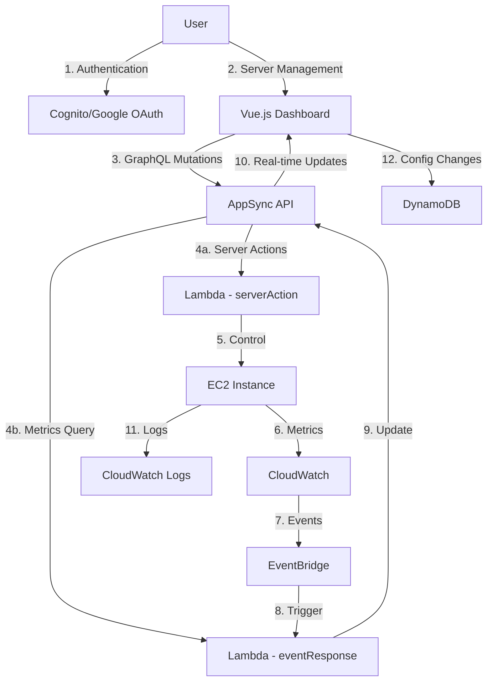

# Minecraft Server Dashboard - Easily Manage AWS-Hosted Minecraft Servers

A web-based dashboard that provides real-time monitoring and management of Minecraft servers running on AWS EC2 instances. This solution enables users to start, stop, configure, and monitor their Minecraft servers through an intuitive interface while optimizing costs through automated shutdown policies.

## Overview

The Minecraft Server Dashboard is a web-based application that enables users to monitor and manage Minecraft servers running on AWS EC2 instances. The application follows a serverless architecture pattern, leveraging AWS services to provide a scalable, reliable, and cost-effective solution.

The dashboard offers comprehensive server management capabilities including:
- Real-time server metrics monitoring (CPU, memory, network usage, active players)
- One-click server start/stop/restart controls
- Automated cost optimization through configurable shutdown policies
- Server configuration management including run commands and working directories
- User access management with Google authentication
- CloudWatch integration for performance monitoring and automated alerts
- IAM role management to ensure proper server permissions

The application is built using Vue.js for the frontend, AWS AppSync for real-time data synchronization, and various AWS services (Lambda, EC2, CloudWatch, etc.) for the backend infrastructure. It uses a serverless architecture to minimize operational overhead while providing scalability and reliability.

## Architecture Diagram

```
┌─────────────────┐     ┌───────────────┐     ┌───────────────────┐
│                 │     │               │     │                   │
│  Vue.js         │────▶│  AWS AppSync  │────▶│  Lambda Functions │
│  Frontend       │     │  GraphQL API  │     │  (Backend)        │
│                 │     │               │     │                   │
└────────┬────────┘     └───────┬───────┘     └─────────┬─────────┘
         │                      │                       │
         │                      │                       │
         ▼                      ▼                       ▼
┌─────────────────┐     ┌───────────────┐     ┌───────────────────┐
│                 │     │               │     │                   │
│  Cognito        │     │  DynamoDB     │     │  EC2 Instances    │
│  Authentication │     │  Tables       │     │  (Minecraft)      │
│                 │     │               │     │                   │
└─────────────────┘     └───────────────┘     └───────────────────┘
                                                       │
                                                       │
                                                       ▼
                                              ┌───────────────────┐
                                              │                   │
                                              │  CloudWatch       │
                                              │  Metrics & Alarms │
                                              │                   │
                                              └───────────────────┘
```

## Repository Structure
```
├── amazon-cloudwatch-agent.json   # CloudWatch agent configuration for metrics collection
├── amplify/                      # Amplify backend configuration and API definitions
├── appsync/                      # AppSync GraphQL schema and resolver implementations
├── cfn/                         # CloudFormation templates for AWS infrastructure
│   ├── template.yaml            # Main CloudFormation template
│   └── templates/               # Nested templates for different components
├── dashboard/                   # Vue.js frontend application
│   ├── src/                    # Source code for the dashboard UI
│   └── components/             # Reusable Vue components
├── lambdas/                    # Lambda functions for server management
│   ├── configServer/           # Server configuration handler
│   ├── eventResponse/          # Event processing for EC2 state changes
│   ├── getMonthlyCost/         # Cost metrics retrieval
│   ├── listServers/            # Server listing functionality
│   └── serverAction/           # Server control actions implementation
└── layers/                     # Shared Lambda layers for common functionality
    ├── authHelper/             # Authentication utilities
    ├── dynHelper/             # DynamoDB interaction helpers
    └── ec2Helper/             # EC2 management utilities
```

## Component Specifications

### 1. Frontend (Vue.js)

**Location:** `./dashboard`

**Technology Stack:**
- Vue 3.js framework
- Vuetify for UI components
- AWS Amplify for AWS service integration
- Vite for build and development

**Key Features:**
- Real-time server metrics display
- Server management controls (start/stop/restart)
- User management interface
- Configuration management
- Cost monitoring

**Environment Configuration:**
- `.env` file contains AWS service endpoints and configuration
- Region, AppSync endpoint, Cognito settings, etc.

### 2. Backend (AWS Lambda)

**Location:** `./lambdas`

**Lambda Functions:**
1. **configServer** - Handles server initialization and configuration
2. **eventResponse** - Processes EC2 state changes and metrics
3. **getMonthlyCost** - Retrieves cost metrics for servers
4. **listServers** - Lists available Minecraft servers
5. **serverAction** - Manages server start/stop/restart operations

**Shared Layers:**
- Authentication helpers
- DynamoDB interaction utilities
- EC2 management utilities

### 3. API Layer (AWS AppSync)

**Location:** `./appsync`

**Components:**
- GraphQL schema defining the API structure
- Resolvers connecting GraphQL operations to data sources
- Authentication directives for securing API access

**Key GraphQL Types:**
- ServerInfo - Basic server information
- ServerMetric - Performance metrics
- ServerConfig - Configuration settings
- ServerUsers - User access management
- MonthlyCost - Cost tracking information
- LogAudit - Audit trail for actions

**Operations:**
- Queries: listServers, getMonthlyCost, getServerConfig, etc.
- Mutations: startServer, stopServer, putServerConfig, etc.
- Subscriptions: onPutServerMetric, onChangeState

### 4. Infrastructure (CloudFormation)

**Location:** `./cfn`

**Deployment Method:**
- AWS SAM (Serverless Application Model)
- CloudFormation templates

**Resources Provisioned:**
- AppSync GraphQL API
- Lambda functions
- DynamoDB tables
- Cognito User Pool and Identity Pool
- IAM roles and policies
- CloudWatch resources
- S3 bucket for frontend hosting
- CloudFront distribution

## Usage Instructions
### Prerequisites
- AWS Account with appropriate permissions
- Node.js 14+ for frontend development
- Python 3.9+ for Lambda functions
- AWS SAM CLI for deployment
- Google OAuth credentials for authentication


## Data Flow

### Server Management Flow
- User initiates action in frontend (e.g., start server)
- Frontend calls AppSync GraphQL mutation
- AppSync invokes appropriate Lambda function
- Lambda performs action on EC2 instance
- State changes propagate back via AppSync subscriptions

### Metrics Collection Flow
- CloudWatch agent on EC2 collects metrics
- Metrics stored in CloudWatch
- Lambda function retrieves and processes metrics
- Metrics published to AppSync
- Frontend receives real-time updates via subscriptions



## Infrastructure


### Lambda Functions
- configServer: Handles server initialization and configuration
- eventResponse: Processes EC2 state changes and metrics
- serverAction: Manages server start/stop/restart operations
- getMonthlyCost: Retrieves cost metrics

### Cognito
- UserPool: Manages user authentication
- IdentityPool: Provides AWS credentials
- Google OAuth integration

### CloudFront/S3
- WebAppBucket: Hosts the Vue.js dashboard
- CloudFront distribution: Serves the web application

### AppSync
- GraphQL API with real-time subscriptions
- DynamoDB data sources
- Custom resolvers for server management

## Security Considerations

1. **Authentication:**
   - Cognito User Pools for user management
   - JWT token-based authentication
   - Google OAuth integration for social login

2. **Authorization:**
   - AppSync fine-grained access control
   - IAM roles for Lambda execution
   - Cognito groups for user permissions

3. **Data Protection:**
   - HTTPS for all communications
   - Encrypted storage for sensitive data
   - Least privilege IAM policies

## Deployment Process

1. **Infrastructure Deployment:**
   ```bash
   cd cfn
   sam build
   sam deploy --guided
   ```

2. **Frontend Deployment:**
   ```bash
   cd dashboard
   npm run build
   aws s3 sync dist/ s3://<web-bucket-name>
   ```

## Future Enhancements

1. **Multi-Region Support:**
   - Deploy servers in multiple AWS regions
   - Global user management

2. **Enhanced Backup System:**
   - Automated world backups
   - Restore functionality

3. **Advanced Metrics:**
   - In-game performance statistics
   - Player activity analytics

4. **Mobile Application:**
   - Companion mobile app for monitoring
   - Push notifications for server events
