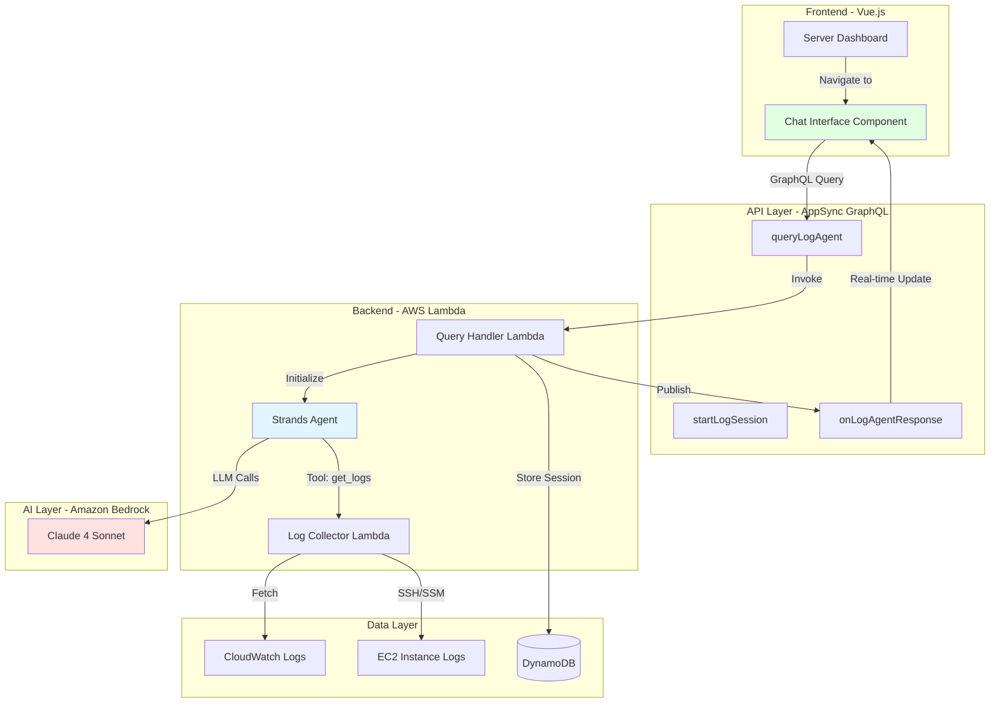

# Design Document: Minecraft Log Analyzer Agent

## Overview

The Minecraft Log Analyzer Agent is an AI-powered conversational interface that enables players and administrators to query and analyze Minecraft server logs using natural language. Built with the Strands Agents SDK and Amazon Bedrock, the agent provides intelligent insights into server activity, player behavior, errors, and performance metrics without requiring users to manually parse log files.

The system integrates seamlessly with the existing Minecraft Server Dashboard infrastructure, leveraging AWS Lambda, AppSync GraphQL API, DynamoDB, and Cognito authentication. The agent uses specialized tools to search, filter, and analyze logs, providing contextual responses that cite specific log entries.

### Key Design Goals

1. **Natural Language Interface**: Users ask questions in plain English rather than writing log queries
2. **Contextual Understanding**: Agent maintains conversation history and understands follow-up questions
3. **Tool-Based Architecture**: Specialized tools for different log analysis tasks (search, player activity, error analysis)
4. **AWS Integration**: Leverages existing infrastructure (Lambda, AppSync, DynamoDB, Cognito)
5. **Real-time and Historical**: Supports both recent log analysis and historical queries
6. **Role-Based Access**: Regular users see logs for their servers, admins see all servers
7. **Cost-Effective**: Efficient token usage, caching, and rate limiting to control Bedrock costs

## Architecture

### High-Level Architecture



### Component Interaction Flow

1. **User Query Flow**:
   - User types question in Chat Interface
   - Frontend sends GraphQL query to AppSync
   - AppSync invokes Query Handler Lambda
   - Query Handler initializes Strands Agent with tools
   - Agent processes query, calls tools as needed
   - Agent generates response with citations
   - Response published via GraphQL subscription
   - Frontend displays response in chat

2. **Log Collection Flow**:
   - Agent determines it needs log data
   - Agent invokes appropriate tool (search_logs, get_player_activity, etc.)
   - Tool calls Log Collector Lambda
   - Log Collector fetches from CloudWatch Logs or EC2
   - Parsed logs returned to tool
   - Tool returns structured data to agent
   - Agent incorporates data into response

3. **Session Management Flow**:
   - First query creates new session in DynamoDB
   - Session stores conversation history (last 10 turns)
   - Subsequent queries retrieve session context
   - Session expires after 30 minutes of inactivity
   - TTL automatically cleans up old sessions

## Components and Interfaces

### Frontend Components

#### LogAnalyzerChat.vue

Vue component providing the conversational interface.

**Props**:
- `serverId: string` - Current server ID for log context
- `serverName: string` - Display name of server

**Data**:
```typescript
{
  messages: Array<{
    id: string,
    role: 'user' | 'assistant',
    content: string,
    timestamp: Date,
    toolCalls?: Array<{name: string, args: object}>
  }>,
  sessionId: string | null,
  isLoading: boolean,
  inputText: string,
  suggestedQueries: string[]
}
```

**Methods**:
- `sendQuery(text: string): Promise<void>` - Send user query to backend
- `initializeSession(): Promise<string>` - Create new session
- `clearSession(): void` - Reset conversation
- `formatResponse(content: string): string` - Render markdown responses

**GraphQL Operations**:
```graphql
query QueryLogAgent($serverId: ID!, $sessionId: ID, $query: String!) {
  queryLogAgent(serverId: $serverId, sessionId: $sessionId, query: $query) {
    sessionId
    response
    toolCalls {
      name
      arguments
    }
    timestamp
  }
}

subscription OnLogAgentResponse($sessionId: ID!) {
  onLogAgentResponse(sessionId: $sessionId) {
    response
    isComplete
    error
  }
}
```

### Backend Components

#### Query Handler Lambda

**Function**: `lambdas/logAgentQuery/index.py`

**Purpose**: Orchestrates agent queries, manages sessions, and coordinates tool execution.

**Handler Signature**:
```python
def handler(event: dict, context: LambdaContext) -> dict:
    """
    Process log analyzer agent queries.
    
    Args:
        event: AppSync GraphQL event with serverId, sessionId, query
        context: Lambda execution context
        
    Returns:
        dict: Response with sessionId, response text, toolCalls
    """
```

**Key Functions**:
- `initialize_agent(server_id: str, user_id: str) -> Agent` - Create agent with tools
- `get_or_create_session(session_id: str, user_id: str) -> dict` - Manage session state
- `save_conversation_turn(session_id: str, user_msg: str, agent_msg: str) -> None`
- `check_authorization(user_id: str, server_id: str) -> bool` - Verify access

**Environment Variables**:
- `SESSIONS_TABLE` - DynamoDB table for conversation sessions
- `AWS_REGION` - AWS region for Bedrock
- `MAX_TOKENS` - Maximum tokens per response (default: 4096)
- `TEMPERATURE` - Model temperature (default: 0.3)

#### Log Collector Lambda

**Function**: `lambdas/logCollector/index.py`

**Purpose**: Retrieves and parses Minecraft server logs from CloudWatch Logs and EC2 instances.

**Handler Signature**:
```python
def handler(event: dict, context: LambdaContext) -> dict:
    """
    Collect logs from CloudWatch or EC2.
    
    Args:
        event: Contains serverId, source, timeRange, filters
        context: Lambda execution context
        
    Returns:
        dict: Parsed log entries with metadata
    """
```

**Key Functions**:
- `fetch_cloudwatch_logs(log_group: str, start_time: int, end_time: int) -> list`
- `fetch_ec2_logs(instance_id: str, log_path: str, lines: int) -> str`
- `parse_log_line(line: str) -> dict` - Extract timestamp, level, thread, message
- `categorize_event(log_entry: dict) -> str` - Classify as player/server/error event

**Log Parsing**:
```python
# Example log line format:
# [10:30:45] [Server thread/INFO]: Player123 joined the game
# [10:31:12] [Server thread/WARN]: Can't keep up! Is the server overloaded?

def parse_log_line(line: str) -> dict:
    """
    Parse Minecraft log line into structured format.
    
    Returns:
        {
            'timestamp': '10:30:45',
            'thread': 'Server thread',
            'level': 'INFO',
            'message': 'Player123 joined the game',
            'category': 'player_activity',
            'player': 'Player123',  # if applicable
            'event_type': 'join'     # if applicable
        }
    """
```

### Agent Tools

#### Tool 1: search_logs

```python
@tool
def search_logs(
    server_id: str,
    keywords: list[str],
    start_time: str = None,
    end_time: str = None,
    log_level: str = None,
    limit: int = 50
) -> list[dict]:
    """
    Search server logs for entries matching keywords and filters.
    
    Args:
        server_id: ID of the Minecraft server
        keywords: List of keywords to search for (case-insensitive)
        start_time: ISO timestamp for start of search range (optional)
        end_time: ISO timestamp for end of search range (optional)
        log_level: Filter by log level: INFO, WARN, ERROR, DEBUG (optional)
        limit: Maximum number of results to return (default: 50)
        
    Returns:
        List of matching log entries with timestamp, level, message
    """
```

#### Tool 2: get_player_activity

```python
@tool
def get_player_activity(
    server_id: str,
    player_name: str,
    start_time: str = None,
    end_time: str = None,
    event_types: list[str] = None
) -> dict:
    """
    Get all activity for a specific player.
    
    Args:
        server_id: ID of the Minecraft server
        player_name: Username of the player
        start_time: ISO timestamp for start of range (optional)
        end_time: ISO timestamp for end of range (optional)
        event_types: Filter by event types: join, leave, chat, death, achievement (optional)
        
    Returns:
        {
            'player': str,
            'total_events': int,
            'events': list[dict],
            'summary': {
                'joins': int,
                'leaves': int,
                'chat_messages': int,
                'deaths': int,
                'achievements': int
            }
        }
    """
```

#### Tool 3: get_error_summary

```python
@tool
def get_error_summary(
    server_id: str,
    start_time: str = None,
    end_time: str = None,
    group_by: str = "type"
) -> dict:
    """
    Aggregate and summarize errors from server logs.
    
    Args:
        server_id: ID of the Minecraft server
        start_time: ISO timestamp for start of range (optional)
        end_time: ISO timestamp for end of range (optional)
        group_by: Group errors by 'type' or 'severity' (default: 'type')
        
    Returns:
        {
            'total_errors': int,
            'total_warnings': int,
            'error_groups': list[{
                'error_type': str,
                'count': int,
                'first_occurrence': str,
                'last_occurrence': str,
                'sample_message': str
            }]
        }
    """
```

#### Tool 4: get_performance_metrics

```python
@tool
def get_performance_metrics(
    server_id: str,
    start_time: str = None,
    end_time: str = None,
    metric_type: str = "all"
) -> dict:
    """
    Extract performance metrics from server logs.
    
    Args:
        server_id: ID of the Minecraft server
        start_time: ISO timestamp for start of range (optional)
        end_time: ISO timestamp for end of range (optional)
        metric_type: Type of metrics: 'tps', 'memory', 'all' (default: 'all')
        
    Returns:
        {
            'tps': {
                'average': float,
                'min': float,
                'max': float,
                'samples': int
            },
            'memory': {
                'average_mb': float,
                'peak_mb': float,
                'samples': int
            },
            'lag_events': list[{
                'timestamp': str,
                'message': str
            }]
        }
    """
```

#### Tool 5: get_recent_events

```python
@tool
def get_recent_events(
    server_id: str,
    count: int = 20,
    event_category: str = "all"
) -> list[dict]:
    """
    Get the most recent log events.
    
    Args:
        server_id: ID of the Minecraft server
        count: Number of recent events to retrieve (default: 20, max: 100)
        event_category: Filter by category: 'all', 'player', 'server', 'error' (default: 'all')
        
    Returns:
        List of recent log entries sorted by timestamp (newest first)
    """
```

#### Tool 6: count_events

```python
@tool
def count_events(
    server_id: str,
    event_type: str,
    start_time: str = None,
    end_time: str = None
) -> dict:
    """
    Count occurrences of specific event types.
    
    Args:
        server_id: ID of the Minecraft server
        event_type: Type of event to count: 'join', 'leave', 'chat', 'death', 'error', 'warning'
        start_time: ISO timestamp for start of range (optional)
        end_time: ISO timestamp for end of range (optional)
        
    Returns:
        {
            'event_type': str,
            'count': int,
            'time_range': {
                'start': str,
                'end': str
            }
        }
    """
```

#### Tool 7: get_security_events (Admin Only)

```python
@tool
def get_security_events(
    server_id: str,
    start_time: str = None,
    end_time: str = None
) -> list[dict]:
    """
    Get security-related events (authentication, permissions, bans).
    Requires admin privileges.
    
    Args:
        server_id: ID of the Minecraft server
        start_time: ISO timestamp for start of range (optional)
        end_time: ISO timestamp for end of range (optional)
        
    Returns:
        List of security events with timestamp, type, player, action
    """
```

## Data Models

### Session Model (DynamoDB)

**Table**: `LogAnalyzerSessions`

**Schema**:
```python
{
    'sessionId': str,          # Partition key (UUID)
    'userId': str,             # Sort key
    'serverId': str,           # Server being analyzed
    'conversationHistory': list[dict],  # Last 10 turns
    'createdAt': int,          # Unix timestamp
    'lastAccessedAt': int,     # Unix timestamp
    'ttl': int                 # Auto-cleanup after 30 minutes
}
```

**Indexes**:
- GSI: `userId-lastAccessedAt-index` - Query user's recent sessions

### Log Entry Model

**Structure** (in-memory, not persisted):
```python
{
    'timestamp': str,          # ISO 8601 format
    'log_level': str,          # INFO, WARN, ERROR, DEBUG
    'thread': str,             # Server thread name
    'message': str,            # Log message content
    'category': str,           # player_activity, server_operation, error, performance
    'player': str | None,      # Player name if applicable
    'event_type': str | None,  # join, leave, chat, death, achievement, etc.
    'raw_line': str            # Original log line
}
```

### Agent Response Model

**Structure**:
```python
{
    'sessionId': str,
    'response': str,           # Natural language response
    'toolCalls': list[dict],   # Tools invoked during processing
    'citations': list[dict],   # Log entries cited in response
    'timestamp': str,
    'tokenUsage': {
        'input': int,
        'output': int,
        'total': int
    }
}
```

## Correctness Properties

*A property is a characteristic or behavior that should hold true across all valid executions of a system—essentially, a formal statement about what the system should do. Properties serve as the bridge between human-readable specifications and machine-verifiable correctness guarantees.*


### Property 1: Log Retrieval Correctness

*For any* server with associated EC2 instance or CloudWatch log group, when logs are requested, the Log_Collector should successfully retrieve logs from the correct source.

**Validates: Requirements 1.1, 1.2**

### Property 2: Time-Range Filtering

*For any* valid time range (start_time, end_time), all log entries returned by the Log_Collector should have timestamps within the specified range (inclusive).

**Validates: Requirements 1.3**

### Property 3: Pagination for Large Logs

*For any* log retrieval request where the total log size exceeds 10MB, the Log_Collector should implement pagination and return logs in chunks rather than attempting to return all logs at once.

**Validates: Requirements 1.4**

### Property 4: Error Message Descriptiveness

*For any* log retrieval failure, the Log_Collector should return an error response containing a descriptive message that indicates the specific failure reason (e.g., "EC2 instance not found", "CloudWatch log group does not exist").

**Validates: Requirements 1.5**

### Property 5: Log Parsing Completeness

*For any* valid Minecraft log line (vanilla, Spigot, Paper, or Forge format), the Log_Parser should successfully extract all present components (timestamp, log level, thread, message) without errors.

**Validates: Requirements 2.1, 2.6**

### Property 6: Event Categorization Accuracy

*For any* parsed log entry, the Log_Parser should assign exactly one category (player_activity, server_operation, error, or performance) based on the log content, and the categorization should be consistent across multiple parses of the same log line.

**Validates: Requirements 2.2, 2.3, 2.4**

### Property 7: Performance Metric Extraction

*For any* log line containing performance metrics (TPS, memory usage), the Log_Parser should extract numeric values that match the values present in the original log line.

**Validates: Requirements 2.5**

### Property 8: Conversation History Persistence

*For any* user session, all messages (user queries and agent responses) should appear in the conversation history in chronological order, and the history should persist for the duration of the session.

**Validates: Requirements 3.1, 3.5**

### Property 9: Response Citation Inclusion

*For any* agent response that makes claims about specific events or data from logs, the response should include citations referencing the specific log entries that support those claims.

**Validates: Requirements 4.7**

### Property 10: Tool Registration Completeness

*For any* agent initialization, all required tools (search_logs, get_player_activity, get_error_summary, get_performance_metrics, get_recent_events, count_events) should be registered and callable by the agent.

**Validates: Requirements 5.1, 5.2, 5.3, 5.4, 5.5, 5.6**

### Property 11: Admin Tool Access Control

*For any* user with admin privileges, the get_security_events tool should be available, and for any user without admin privileges, the get_security_events tool should not be available.

**Validates: Requirements 5.7**

### Property 12: Player Activity Tool Correctness

*For any* player name and time range, the get_player_activity tool should return only log entries where the player field matches the specified player name and the timestamp falls within the specified range.

**Validates: Requirements 5.2**

### Property 13: Error Aggregation Accuracy

*For any* set of error logs, the get_error_summary tool should return counts that match the actual number of errors of each type in the logs, and the first/last occurrence timestamps should match the actual earliest and latest occurrences.

**Validates: Requirements 5.3**

### Property 14: Performance Metric Calculation

*For any* set of performance logs containing TPS and memory values, the get_performance_metrics tool should calculate averages, minimums, and maximums that match the actual statistical values from the log data.

**Validates: Requirements 5.4**

### Property 15: Recent Events Ordering

*For any* request for N recent events, the get_recent_events tool should return exactly N events (or fewer if fewer exist), and they should be ordered by timestamp with the most recent event first.

**Validates: Requirements 5.5**

### Property 16: Event Counting Accuracy

*For any* event type and time range, the count_events tool should return a count that exactly matches the number of events of that type within the specified time range.

**Validates: Requirements 5.6**

### Property 17: Peak Activity Detection

*For any* set of player activity logs spanning multiple time periods, the Insight_Engine should identify peak activity times that correspond to periods with the highest number of player events.

**Validates: Requirements 6.2**

### Property 18: Daily Summary Generation

*For any* complete day of server logs, the Insight_Engine should generate a summary report containing key statistics (player count, error count, performance metrics) that accurately reflect the day's activity.

**Validates: Requirements 6.5**

### Property 19: Authentication Verification

*For any* agent query request, the System should verify that a valid Cognito authentication token is present, and should reject requests without valid authentication.

**Validates: Requirements 7.1**

### Property 20: Server Access Authorization

*For any* regular (non-admin) user and server ID, the Agent should only return logs if the user has explicit access to that server, and should deny access otherwise.

**Validates: Requirements 7.2**

### Property 21: Admin Unrestricted Access

*For any* user with admin privileges and any server ID, the Agent should allow access to logs for that server regardless of explicit access grants.

**Validates: Requirements 7.3**

### Property 22: Security Query Authorization

*For any* security-sensitive query (using get_security_events tool), the System should verify the user has admin privileges before executing the query, and should deny non-admin users.

**Validates: Requirements 7.4**

### Property 23: Query Audit Logging

*For any* agent query, the System should create an audit log entry containing the user ID, server ID, query text, and timestamp.

**Validates: Requirements 7.5**

### Property 24: Session History Storage

*For any* conversation session, the Session_Manager should store conversation history in DynamoDB with a TTL value set for automatic cleanup after 30 minutes of inactivity.

**Validates: Requirements 8.4**

### Property 25: Conversation Context Limit

*For any* conversation session with more than 10 turns, the Session_Manager should maintain only the most recent 10 turns in the conversation context, discarding older turns.

**Validates: Requirements 8.5**

### Property 26: Session History Clearing

*For any* user switching from one server to another, the Chat_Interface should clear the conversation history, resulting in an empty message list.

**Validates: Requirements 9.5**

### Property 27: Error Handling with User Feedback

*For any* log retrieval failure, the Agent should generate a response that informs the user of the failure and includes actionable suggestions (e.g., "check server connectivity", "verify server is running").

**Validates: Requirements 10.1**

### Property 28: Retry with Exponential Backoff

*For any* Bedrock API call failure, the System should retry the call up to 3 times with exponential backoff delays (e.g., 1s, 2s, 4s) before returning an error.

**Validates: Requirements 10.3**

### Property 29: Token Limit Handling

*For any* conversation that exceeds the model's token limit, the System should summarize earlier conversation turns to reduce token count while preserving essential context.

**Validates: Requirements 10.4**

### Property 30: Error Logging to CloudWatch

*For any* error that occurs during agent operation, the System should log detailed error information (error type, message, stack trace, context) to CloudWatch Logs.

**Validates: Requirements 10.5**

### Property 31: Response Time Performance

*For any* agent query, the response time should be within acceptable bounds: simple queries (using 0-1 tools) should respond within 5 seconds, and complex queries (using 2+ tools) should respond within 15 seconds, measured from query submission to response delivery.

**Validates: Requirements 11.1, 11.2**

### Property 32: Concurrent Session Support

*For any* set of up to 10 concurrent agent sessions, the System should handle all sessions without performance degradation (response times should not increase by more than 20% compared to single-session performance).

**Validates: Requirements 11.3**

### Property 33: Log Caching Behavior

*For any* log segment that is accessed, the Log_Collector should cache it for 5 minutes, and subsequent requests for the same log segment within that time should be served from cache without fetching from the source.

**Validates: Requirements 11.4**

### Property 34: Rate Limiting Enforcement

*For any* user submitting more than 30 queries within a 1-minute window, the System should reject subsequent queries with a rate limit error until the rate falls below the threshold.

**Validates: Requirements 11.5**

### Property 35: Token Usage Tracking

*For any* agent query, the System should record the Bedrock API token usage (input tokens, output tokens, total tokens) associated with the user ID and server ID.

**Validates: Requirements 12.1, 12.2**

### Property 36: Cost Threshold Alerting

*For any* monitoring period where the cumulative monthly costs exceed the configured threshold, the System should send an alert notification to administrators.

**Validates: Requirements 12.3**

### Property 37: Feature Disable Control

*For any* server or global configuration where the agent feature is disabled, the System should reject agent queries for that scope with an appropriate message indicating the feature is disabled.

**Validates: Requirements 12.5**

## Error Handling

### Error Categories

1. **Authentication Errors**
   - Invalid or expired Cognito token
   - Missing authentication credentials
   - Response: HTTP 401 with message "Authentication required"

2. **Authorization Errors**
   - User lacks access to requested server
   - Non-admin attempting security queries
   - Response: HTTP 403 with message "Access denied to server logs"

3. **Log Retrieval Errors**
   - EC2 instance not found or not accessible
   - CloudWatch log group does not exist
   - Network timeout connecting to log source
   - Response: Descriptive error message with troubleshooting suggestions

4. **Parsing Errors**
   - Unrecognized log format
   - Corrupted log data
   - Response: Log warning, skip malformed entries, continue processing

5. **Agent Errors**
   - Bedrock API failure (after retries)
   - Token limit exceeded
   - Tool execution failure
   - Response: User-friendly error message, log detailed error to CloudWatch

6. **Rate Limiting Errors**
   - User exceeds query rate limit
   - Response: HTTP 429 with message "Rate limit exceeded, try again in X seconds"

7. **Session Errors**
   - Session not found or expired
   - DynamoDB write failure
   - Response: Create new session, log error

### Error Recovery Strategies

1. **Retry with Backoff**: Bedrock API calls retry 3 times with exponential backoff (1s, 2s, 4s)
2. **Graceful Degradation**: If log parsing fails for some entries, process remaining entries
3. **Fallback Responses**: If agent cannot answer, provide helpful guidance on reformulating query
4. **Session Recovery**: If session retrieval fails, create new session automatically
5. **Cache Invalidation**: On log retrieval errors, invalidate cache and retry from source

### Error Logging

All errors logged to CloudWatch with structured format:
```python
{
    'timestamp': str,
    'error_type': str,
    'error_message': str,
    'stack_trace': str,
    'context': {
        'user_id': str,
        'server_id': str,
        'session_id': str,
        'query': str
    }
}
```

## Testing Strategy

### Dual Testing Approach

This feature requires both unit testing and property-based testing to ensure comprehensive coverage:

- **Unit tests**: Verify specific examples, edge cases, and error conditions
- **Property tests**: Verify universal properties across all inputs using randomized testing

Together, these approaches provide comprehensive coverage where unit tests catch concrete bugs and property tests verify general correctness.

### Property-Based Testing

We will use **Hypothesis** (Python property-based testing library) for backend Lambda functions and tools. Each property test will:

- Run a minimum of 100 iterations with randomized inputs
- Reference the design document property it validates
- Use appropriate generators for test data (log lines, timestamps, user IDs, etc.)

**Tag Format**: Each property test must include a comment:
```python
# Feature: minecraft-log-analyzer-agent, Property {number}: {property_text}
```

**Example Property Test**:
```python
from hypothesis import given, strategies as st
import pytest

# Feature: minecraft-log-analyzer-agent, Property 2: Time-Range Filtering
@given(
    start_time=st.datetimes(),
    end_time=st.datetimes(),
    log_entries=st.lists(st.builds(LogEntry))
)
def test_time_range_filtering(start_time, end_time, log_entries):
    """For any valid time range, all returned logs should fall within that range."""
    if start_time > end_time:
        start_time, end_time = end_time, start_time
    
    filtered = filter_logs_by_time(log_entries, start_time, end_time)
    
    for entry in filtered:
        assert start_time <= entry.timestamp <= end_time
```

### Unit Testing

Unit tests focus on:

1. **Specific Examples**: Known log formats, common queries, typical user scenarios
2. **Edge Cases**: Empty logs, malformed data, boundary conditions
3. **Error Conditions**: Network failures, authentication errors, rate limiting
4. **Integration Points**: AppSync resolvers, DynamoDB operations, Bedrock API calls

**Example Unit Test**:
```python
def test_parse_vanilla_minecraft_log():
    """Test parsing a standard vanilla Minecraft log line."""
    log_line = "[10:30:45] [Server thread/INFO]: Player123 joined the game"
    
    result = parse_log_line(log_line)
    
    assert result['timestamp'] == '10:30:45'
    assert result['thread'] == 'Server thread'
    assert result['level'] == 'INFO'
    assert result['message'] == 'Player123 joined the game'
    assert result['category'] == 'player_activity'
    assert result['player'] == 'Player123'
    assert result['event_type'] == 'join'
```

### Frontend Testing

Frontend tests use **Vitest** and **Vue Test Utils**:

1. **Component Tests**: Verify Chat Interface rendering, user interactions, message display
2. **Integration Tests**: Test GraphQL query/subscription integration
3. **E2E Tests**: Full user workflows (optional, marked with `*` in tasks)

### Test Coverage Goals

- Backend Lambda functions: 80% code coverage
- Frontend components: 70% code coverage
- All correctness properties: 100% coverage with property tests
- All error conditions: 100% coverage with unit tests

### Testing Tools and Libraries

**Backend**:
- `pytest`: Test framework
- `hypothesis`: Property-based testing
- `moto`: AWS service mocking (DynamoDB, CloudWatch, EC2)
- `boto3`: AWS SDK for integration tests

**Frontend**:
- `vitest`: Test framework
- `@vue/test-utils`: Vue component testing
- `@aws-amplify/api`: GraphQL testing

### Continuous Integration

Tests run automatically on:
- Pull request creation
- Commits to main branch
- Scheduled daily runs

CI pipeline includes:
1. Linting (pylint, eslint)
2. Unit tests
3. Property tests (100 iterations minimum)
4. Integration tests
5. Coverage reporting

## Implementation Notes

### Strands Agent Configuration

```python
from strands import Agent
from strands.models import BedrockModel

# Initialize Bedrock model
model = BedrockModel(
    model_id="anthropic.claude-sonnet-4-20250514-v1:0",
    region_name="us-west-2",
    temperature=0.3,  # Lower temperature for factual responses
    max_tokens=4096,
)

# Create agent with tools
agent = Agent(
    model=model,
    tools=[
        search_logs,
        get_player_activity,
        get_error_summary,
        get_performance_metrics,
        get_recent_events,
        count_events,
        get_security_events  # Only if user is admin
    ],
    system_prompt="""You are an expert Minecraft server log analyzer. 
    You help players and administrators understand server activity by analyzing logs.
    
    When answering questions:
    - Use the provided tools to search and analyze logs
    - Always cite specific log entries when making claims
    - Provide timestamps in a readable format
    - Explain technical errors in simple terms
    - Suggest actionable next steps when problems are found
    
    Be concise but thorough. Format responses with markdown for readability."""
)
```

### Log Format Examples

**Vanilla Minecraft**:
```
[10:30:45] [Server thread/INFO]: Player123 joined the game
[10:31:12] [Server thread/WARN]: Can't keep up! Is the server overloaded?
[10:32:05] [Server thread/INFO]: Player123 left the game
```

**Spigot/Paper**:
```
[10:30:45 INFO]: Player123[/192.168.1.100:54321] logged in with entity id 123
[10:31:12 WARN]: [WorldEdit] Task #123 generated an exception
[10:32:05 INFO]: Player123 lost connection: Disconnected
```

**Performance Metrics**:
```
[10:30:00 INFO]: TPS: 19.8, Memory: 2048MB/4096MB
[10:30:30 WARN]: Can't keep up! Did the system time change, or is the server overloaded?
```

### DynamoDB Schema Details

**LogAnalyzerSessions Table**:
- Partition Key: `sessionId` (String)
- Sort Key: `userId` (String)
- TTL Attribute: `ttl` (Number, Unix timestamp)
- GSI: `userId-lastAccessedAt-index`
  - Partition Key: `userId`
  - Sort Key: `lastAccessedAt`

**Conversation History Format**:
```python
{
    'conversationHistory': [
        {
            'role': 'user',
            'content': 'What errors occurred in the last hour?',
            'timestamp': '2025-01-15T10:30:00Z'
        },
        {
            'role': 'assistant',
            'content': 'I found 3 errors in the last hour...',
            'timestamp': '2025-01-15T10:30:05Z',
            'toolCalls': [
                {'name': 'search_logs', 'args': {...}}
            ]
        }
    ]
}
```

### GraphQL Schema Extensions

```graphql
type Query {
  queryLogAgent(
    serverId: ID!
    sessionId: ID
    query: String!
  ): LogAgentResponse @aws_cognito_user_pools
}

type LogAgentResponse {
  sessionId: ID!
  response: String!
  toolCalls: [ToolCall]
  citations: [LogCitation]
  timestamp: AWSDateTime!
  tokenUsage: TokenUsage
}

type ToolCall {
  name: String!
  arguments: AWSJSON!
}

type LogCitation {
  timestamp: AWSDateTime!
  logLevel: String!
  message: String!
  source: String!
}

type TokenUsage {
  inputTokens: Int!
  outputTokens: Int!
  totalTokens: Int!
}

type Subscription {
  onLogAgentResponse(sessionId: ID!): LogAgentStreamResponse
    @aws_subscribe(mutations: ["putLogAgentResponse"])
}

type LogAgentStreamResponse {
  sessionId: ID!
  response: String!
  isComplete: Boolean!
  error: String
}
```

### Cost Optimization Strategies

1. **Prompt Caching**: Use Bedrock prompt caching for system prompts (1024+ tokens)
2. **Token Limits**: Set max_tokens=4096 to prevent excessive generation
3. **Rate Limiting**: 30 queries/user/minute prevents abuse
4. **Log Caching**: 5-minute cache reduces redundant log fetches
5. **Session TTL**: 30-minute TTL automatically cleans up inactive sessions
6. **Efficient Tools**: Tools return only necessary data, not entire log files
7. **Conversation Pruning**: Keep only last 10 turns to minimize context tokens

### Security Considerations

1. **Input Validation**: Sanitize all user queries before processing
2. **SQL Injection Prevention**: Use parameterized queries for DynamoDB
3. **Log Sanitization**: Remove sensitive data (IPs, emails) from logs before analysis
4. **Rate Limiting**: Prevent DoS attacks through query flooding
5. **Audit Logging**: Track all queries for security monitoring
6. **Least Privilege**: Lambda roles have minimal required permissions
7. **Encryption**: All data encrypted in transit (HTTPS) and at rest (DynamoDB encryption)

### Monitoring and Observability

**CloudWatch Metrics**:
- `AgentQueryCount`: Number of queries per minute
- `AgentResponseTime`: P50, P95, P99 response times
- `AgentErrorRate`: Percentage of failed queries
- `BedrockTokenUsage`: Total tokens consumed
- `BedrockCost`: Estimated cost per query
- `CacheHitRate`: Percentage of log requests served from cache

**CloudWatch Alarms**:
- High error rate (>5% over 5 minutes)
- Slow response times (P95 >15 seconds)
- High cost rate (>$10/hour)
- Rate limit violations (>100/minute)

**CloudWatch Logs**:
- All agent queries and responses
- Tool invocations and results
- Errors with full stack traces
- Performance metrics per query

### Deployment Considerations

1. **Lambda Configuration**:
   - Memory: 1024 MB (sufficient for Strands SDK)
   - Timeout: 30 seconds (allows for tool execution)
   - Reserved Concurrency: 10 (prevents cost runaway)

2. **Dependencies**:
   - Package Strands SDK and dependencies in Lambda layer
   - Use Lambda container image for large dependencies (>250MB)

3. **Environment Variables**:
   - `AWS_REGION`: us-west-2
   - `SESSIONS_TABLE`: LogAnalyzerSessions
   - `MAX_TOKENS`: 4096
   - `TEMPERATURE`: 0.3
   - `RATE_LIMIT_PER_MINUTE`: 30

4. **IAM Permissions**:
   - Bedrock: `bedrock:InvokeModel`
   - DynamoDB: `dynamodb:GetItem`, `dynamodb:PutItem`, `dynamodb:Query`
   - CloudWatch Logs: `logs:CreateLogGroup`, `logs:CreateLogStream`, `logs:PutLogEvents`
   - EC2: `ec2:DescribeInstances` (for log collection)
   - SSM: `ssm:SendCommand` (for EC2 log retrieval)

5. **VPC Configuration**:
   - Lambda in VPC if accessing EC2 instances directly
   - NAT Gateway for Bedrock API access from VPC
   - Security groups allow HTTPS outbound

### Future Enhancements

1. **Multi-Server Analysis**: Compare logs across multiple servers
2. **Anomaly Detection**: ML-based detection of unusual patterns
3. **Automated Remediation**: Agent suggests and executes fixes
4. **Voice Interface**: Voice queries via Alexa/Google Assistant
5. **Scheduled Reports**: Automated daily/weekly summary emails
6. **Custom Insights**: User-defined patterns and alerts
7. **Log Visualization**: Interactive charts and graphs
8. **Plugin Integration**: Analyze plugin-specific logs (WorldEdit, EssentialsX, etc.)
