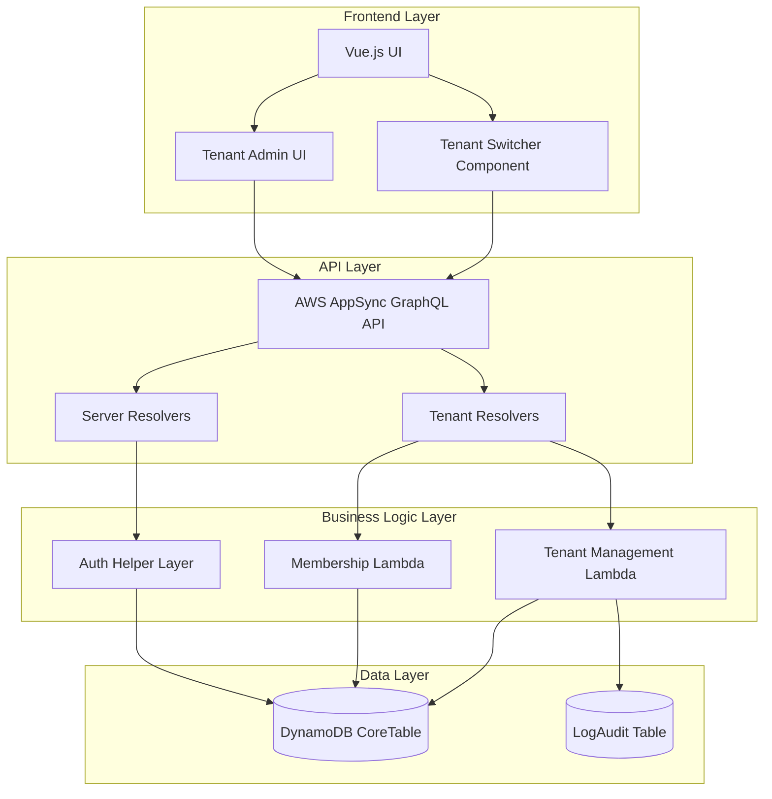

# Design Document: Multi-Tenancy

## Overview

This design document specifies the implementation of multi-tenancy for the Minecraft Server Dashboard application. The multi-tenancy feature enables organizations to group users and servers under tenant entities, providing tenant-level access control, data isolation, and administrative capabilities.

The design leverages the existing DynamoDB CoreTable with PK/SK pattern, extends the GraphQL API with tenant operations, and maintains backward compatibility with legacy single-tenant servers. The implementation follows a tenant-scoped authorization model where users belong to one or more tenants, servers are assigned to tenants, and access is controlled through tenant memberships.

### Key Design Principles

1. **Backward Compatibility**: Existing servers without tenant assignments continue to function using legacy authorization
2. **Data Isolation**: Strict tenant boundaries prevent cross-tenant data access
3. **Flexible Membership**: Users can belong to multiple tenants with different roles
4. **Minimal Migration**: Leverage existing DynamoDB table structure with new access patterns
5. **Scalable Authorization**: DynamoDB-based membership checks replace Cognito group-based authorization

## Architecture

### High-Level Architecture



### Data Flow

**Tenant Creation Flow:**
1. User initiates tenant creation via GraphQL mutation
2. AppSync validates Cognito authentication
3. Tenant Lambda generates unique tenant ID
4. Lambda writes tenant metadata to CoreTable
5. Lambda creates initial admin membership for creator
6. Lambda logs audit event
7. Response returns tenant information to UI

**Server Access Flow:**
1. User requests server information via GraphQL query
2. AppSync validates Cognito authentication and extracts user sub
3. Server resolver queries user's tenant memberships from CoreTable
4. Resolver filters servers to only those in user's authorized tenants
5. For each server, resolver validates tenant membership and role
6. Response returns authorized servers to UI

**Tenant Switching Flow:**
1. User selects different tenant in UI
2. Frontend updates tenant context in Vuex store
3. UI re-queries servers filtered by new tenant context
4. Server list updates to show only servers from selected tenant

## Components and Interfaces

### DynamoDB Data Model

The CoreTable uses a single-table design with PK/SK pattern to store all tenant-related data:

#### Tenant Metadata
```
PK: TENANT#<tenantId>
SK: METADATA
Attributes:
  - tenantId: string (UUID)
  - tenantName: string
  - createdAt: timestamp
  - updatedAt: timestamp
  - createdBy: string (user sub)
  - status: string (active, suspended, deleted)
```

#### Tenant Settings
```
PK: TENANT#<tenantId>
SK: SETTINGS
Attributes:
  - defaultAlarmThreshold: number
  - defaultAlarmEvaluationPeriod: number
  - defaultRunCommand: string
  - defaultWorkDir: string
  - autoConfigureServers: boolean
  - allowUserInvitations: boolean
```

#### User-Tenant Membership
```
PK: USER#<userId>
SK: TENANT#<tenantId>
Attributes:
  - userId: string (Cognito sub)
  - tenantId: string
  - role: string (admin, member, viewer)
  - createdAt: timestamp
  - updatedAt: timestamp
  - addedBy: string (user sub)
```

#### Tenant-User Membership (GSI)
```
PK: TENANT#<tenantId>
SK: USER#<userId>
Attributes:
  - Same as User-Tenant Membership
  - Enables querying all users in a tenant
```

#### Server-Tenant Assignment
```
PK: SERVER#<instanceId>
SK: METADATA
Attributes:
  - (existing server fields)
  - tenantId: string (nullable for legacy servers)
  - assignedAt: timestamp
  - assignedBy: string (user sub)
```

#### Tenant Invitation
```
PK: INVITATION#<invitationId>
SK: METADATA
Attributes:
  - invitationId: string (UUID)
  - tenantId: string
  - inviterUserId: string
  - inviteeEmail: string
  - role: string (admin, member, viewer)
  - status: string (pending, accepted, expired, revoked)
  - createdAt: timestamp
  - expiresAt: timestamp
  - acceptedAt: timestamp (nullable)
```

#### Tenant Audit Log
```
PK: TENANT#<tenantId>
SK: LOG#<timestamp>#<actionId>
Attributes:
  - tenantId: string
  - timestamp: number
  - actionId: string (UUID)
  - actorUserId: string
  - actorEmail: string
  - action: string (create_tenant, add_member, remove_member, assign_server, etc.)
  - targetType: string (tenant, user, server, invitation)
  - targetId: string
  - details: JSON
```

### Access Patterns

1. **Get tenant by ID**: Query PK=TENANT#<tenantId>, SK=METADATA
2. **Get tenant settings**: Query PK=TENANT#<tenantId>, SK=SETTINGS
3. **Get user's tenants**: Query PK=USER#<userId>, SK begins_with TENANT#
4. **Get tenant members**: Query GSI where SK=TENANT#<tenantId>, PK begins_with USER#
5. **Get server's tenant**: Query PK=SERVER#<instanceId>, SK=METADATA, read tenantId attribute
6. **Get tenant's servers**: Scan with filter tenantId=<tenantId> (or maintain separate index)
7. **Get pending invitations for tenant**: Query PK begins_with INVITATION#, filter by tenantId and status
8. **Get tenant audit logs**: Query PK=TENANT#<tenantId>, SK begins_with LOG#, with optional timestamp range

### GraphQL Schema Extensions

```graphql
# Tenant Types
type Tenant @aws_cognito_user_pools {
  tenantId: ID!
  tenantName: String!
  createdAt: AWSDateTime!
  updatedAt: AWSDateTime!
  createdBy: String!
  status: String!
  memberCount: Int
  serverCount: Int
}

input TenantInput {
  tenantName: String!
}

input UpdateTenantInput {
  tenantId: ID!
  tenantName: String
}

# Tenant Membership Types
type TenantMembership @aws_cognito_user_pools {
  userId: String!
  tenantId: String!
  userEmail: AWSEmail!
  userFullName: String!
  role: TenantRole!
  createdAt: AWSDateTime!
  updatedAt: AWSDateTime!
  addedBy: String!
}

enum TenantRole {
  admin
  member
  viewer
}

input AddTenantMemberInput {
  tenantId: ID!
  userEmail: AWSEmail!
  role: TenantRole!
}

input UpdateTenantMemberRoleInput {
  tenantId: ID!
  userId: String!
  role: TenantRole!
}

input RemoveTenantMemberInput {
  tenantId: ID!
  userId: String!
}

# Tenant Invitation Types
type TenantInvitation @aws_cognito_user_pools {
  invitationId: ID!
  tenantId: String!
  tenantName: String!
  inviterEmail: AWSEmail!
  inviteeEmail: AWSEmail!
  role: TenantRole!
  status: String!
  createdAt: AWSDateTime!
  expiresAt: AWSDateTime!
}

input CreateTenantInvitationInput {
  tenantId: ID!
  inviteeEmail: AWSEmail!
  role: TenantRole!
}

input AcceptTenantInvitationInput {
  invitationId: ID!
}

# Tenant Settings Types
type TenantSettings @aws_cognito_user_pools {
  tenantId: ID!
  defaultAlarmThreshold: Float
  defaultAlarmEvaluationPeriod: Int
  defaultRunCommand: String
  defaultWorkDir: String
  autoConfigureServers: Boolean
  allowUserInvitations: Boolean
}

input UpdateTenantSettingsInput {
  tenantId: ID!
  defaultAlarmThreshold: Float
  defaultAlarmEvaluationPeriod: Int
  defaultRunCommand: String
  defaultWorkDir: String
  autoConfigureServers: Boolean
  allowUserInvitations: Boolean
}

# Tenant Audit Log Types
type TenantAuditLog @aws_cognito_user_pools {
  tenantId: String!
  timestamp: AWSTimestamp!
  actionId: ID!
  actorEmail: AWSEmail!
  action: String!
  targetType: String!
  targetId: String!
  details: AWSJSON
}

# Extended Server Type
extend type ServerInfo {
  tenantId: String
  tenantName: String
}

# Queries
extend type Query {
  # Get user's tenants
  listMyTenants: [Tenant] @aws_cognito_user_pools
  
  # Get specific tenant (requires membership)
  getTenant(tenantId: ID!): Tenant @aws_cognito_user_pools
  
  # Get tenant members (requires admin role)
  listTenantMembers(tenantId: ID!): [TenantMembership] @aws_cognito_user_pools
  
  # Get tenant settings (requires membership)
  getTenantSettings(tenantId: ID!): TenantSettings @aws_cognito_user_pools
  
  # Get pending invitations for user
  listMyInvitations: [TenantInvitation] @aws_cognito_user_pools
  
  # Get tenant audit logs (requires admin role)
  getTenantAuditLogs(tenantId: ID!, startTime: AWSTimestamp, endTime: AWSTimestamp): [TenantAuditLog] @aws_cognito_user_pools
  
  # Get servers for tenant (requires membership)
  listTenantServers(tenantId: ID!): [ServerInfo] @aws_cognito_user_pools
}

# Mutations
extend type Mutation {
  # Create new tenant
  createTenant(input: TenantInput!): Tenant @aws_cognito_user_pools
  
  # Update tenant information (requires admin role)
  updateTenant(input: UpdateTenantInput!): Tenant @aws_cognito_user_pools
  
  # Delete tenant (requires admin role, no servers assigned)
  deleteTenant(tenantId: ID!): AWSJSON @aws_cognito_user_pools
  
  # Add member to tenant (requires admin role)
  addTenantMember(input: AddTenantMemberInput!): TenantMembership @aws_cognito_user_pools
  
  # Update member role (requires admin role)
  updateTenantMemberRole(input: UpdateTenantMemberRoleInput!): TenantMembership @aws_cognito_user_pools
  
  # Remove member from tenant (requires admin role)
  removeTenantMember(input: RemoveTenantMemberInput!): AWSJSON @aws_cognito_user_pools
  
  # Assign server to tenant (requires admin role)
  assignServerToTenant(instanceId: String!, tenantId: ID!): ServerInfo @aws_cognito_user_pools
  
  # Unassign server from tenant (requires admin role)
  unassignServerFromTenant(instanceId: String!): ServerInfo @aws_cognito_user_pools
  
  # Create invitation (requires admin role or member if allowed)
  createTenantInvitation(input: CreateTenantInvitationInput!): TenantInvitation @aws_cognito_user_pools
  
  # Accept invitation
  acceptTenantInvitation(input: AcceptTenantInvitationInput!): TenantMembership @aws_cognito_user_pools
  
  # Revoke invitation (requires admin role)
  revokeTenantInvitation(invitationId: ID!): AWSJSON @aws_cognito_user_pools
  
  # Update tenant settings (requires admin role)
  updateTenantSettings(input: UpdateTenantSettingsInput!): TenantSettings @aws_cognito_user_pools
}
```

### Lambda Functions

#### tenantManager Lambda
**Purpose**: Handle tenant CRUD operations and membership management

**Responsibilities**:
- Create, update, delete tenants
- Add, update, remove tenant members
- Validate tenant admin permissions
- Write audit logs for tenant operations
- Enforce business rules (e.g., prevent last admin removal)

**Handler Functions**:
- `create_tenant(event, context)`: Create new tenant
- `update_tenant(event, context)`: Update tenant metadata
- `delete_tenant(event, context)`: Delete tenant (with validation)
- `add_member(event, context)`: Add user to tenant
- `update_member_role(event, context)`: Change user's tenant role
- `remove_member(event, context)`: Remove user from tenant
- `list_members(event, context)`: Get all tenant members
- `list_user_tenants(event, context)`: Get user's tenant memberships

**Authorization**: Validates user is tenant admin or global admin for write operations

#### tenantInvitationManager Lambda
**Purpose**: Handle tenant invitation lifecycle

**Responsibilities**:
- Create invitations with expiration
- Validate invitation permissions
- Process invitation acceptance
- Revoke pending invitations
- Clean up expired invitations

**Handler Functions**:
- `create_invitation(event, context)`: Create new invitation
- `accept_invitation(event, context)`: Accept invitation and create membership
- `revoke_invitation(event, context)`: Revoke pending invitation
- `list_user_invitations(event, context)`: Get user's pending invitations

**Authorization**: Validates user is tenant admin (or member if allowed by settings)

#### tenantSettingsManager Lambda
**Purpose**: Manage tenant-level configuration

**Responsibilities**:
- Get tenant settings
- Update tenant settings
- Apply default settings to new servers
- Validate setting values

**Handler Functions**:
- `get_settings(event, context)`: Retrieve tenant settings
- `update_settings(event, context)`: Update tenant settings
- `apply_defaults_to_server(instance_id, tenant_id)`: Apply tenant defaults to server

**Authorization**: Validates user is tenant admin for updates

#### Extended authHelper Layer
**Purpose**: Tenant-aware authorization checks

**New Methods**:
```python
def check_tenant_membership(user_sub: str, tenant_id: str) -> tuple[bool, str]:
    """Check if user is member of tenant, return (is_member, role)"""
    
def check_tenant_admin(user_sub: str, tenant_id: str) -> bool:
    """Check if user is admin of tenant"""
    
def check_server_access(user_sub: str, instance_id: str, required_permission: str) -> tuple[bool, str, str]:
    """Check if user can access server through tenant membership"""
    
def get_user_tenants(user_sub: str) -> list[dict]:
    """Get all tenants user belongs to"""
    
def get_tenant_servers(tenant_id: str) -> list[str]:
    """Get all servers assigned to tenant"""
    
def is_global_admin(user_sub: str) -> bool:
    """Check if user has global admin flag"""
```

#### Extended ec2Discovery Lambda
**Purpose**: Filter servers by tenant membership

**Changes**:
- Query user's tenant memberships
- Filter discovered servers to only those in user's tenants
- Include legacy servers (no tenantId) if user has legacy memberships
- Add tenantId and tenantName to server response

#### Extended Server Control Lambdas
**Purpose**: Validate tenant-scoped authorization for server operations

**Changes** (ec2ActionValidator, ec2ActionWorker):
- Replace Cognito group checks with tenant membership checks
- Validate user has appropriate role in server's tenant
- Log tenant context in audit logs

### Frontend Components

#### TenantSwitcher Component
**Location**: `webapp/src/components/TenantSwitcher.vue`

**Purpose**: Allow users to switch between their tenants

**Features**:
- Dropdown showing user's tenants
- Display current tenant name
- Update Vuex store on tenant change
- Trigger server list refresh on switch

**Props**: None (reads from Vuex store)

**Events**: 
- `tenant-changed`: Emitted when user switches tenant

#### TenantManagement Component
**Location**: `webapp/src/components/TenantManagement.vue`

**Purpose**: Admin interface for managing tenant

**Features**:
- Display tenant information
- List tenant members with roles
- Add/remove members
- Update member roles
- Create invitations
- View pending invitations
- Assign/unassign servers
- Update tenant settings
- View audit logs

**Props**:
- `tenantId`: Current tenant ID

**Permissions**: Only visible to tenant admins

#### TenantInvitations Component
**Location**: `webapp/src/components/TenantInvitations.vue`

**Purpose**: Display and accept tenant invitations

**Features**:
- List pending invitations
- Show invitation details (tenant, role, expiration)
- Accept invitation button
- Decline invitation button

**Props**: None (queries user's invitations)

#### Extended ServerCard Component
**Changes**:
- Display tenant name badge
- Show "Legacy" badge for servers without tenant
- Filter by current tenant context

#### Vuex Store Extensions

**New State**:
```javascript
state: {
  currentTenant: null,
  userTenants: [],
  tenantMembers: {},
  tenantSettings: {},
  pendingInvitations: []
}
```

**New Actions**:
```javascript
actions: {
  async fetchUserTenants({ commit }),
  async switchTenant({ commit }, tenantId),
  async createTenant({ commit }, tenantName),
  async fetchTenantMembers({ commit }, tenantId),
  async addTenantMember({ commit }, { tenantId, email, role }),
  async removeTenantMember({ commit }, { tenantId, userId }),
  async updateMemberRole({ commit }, { tenantId, userId, role }),
  async assignServerToTenant({ commit }, { instanceId, tenantId }),
  async fetchPendingInvitations({ commit }),
  async acceptInvitation({ commit }, invitationId),
  async fetchTenantSettings({ commit }, tenantId),
  async updateTenantSettings({ commit }, settings)
}
```

**New Getters**:
```javascript
getters: {
  currentTenant: state => state.currentTenant,
  userTenants: state => state.userTenants,
  isTenantAdmin: state => tenantId => {
    const membership = state.userTenants.find(t => t.tenantId === tenantId)
    return membership?.role === 'admin'
  },
  tenantServers: (state, getters, rootState) => {
    if (!state.currentTenant) return []
    return rootState.servers.filter(s => s.tenantId === state.currentTenant.tenantId)
  }
}
```

## Data Models

### Tenant Entity
```typescript
interface Tenant {
  tenantId: string;          // UUID
  tenantName: string;        // Display name
  createdAt: string;         // ISO timestamp
  updatedAt: string;         // ISO timestamp
  createdBy: string;         // User sub
  status: 'active' | 'suspended' | 'deleted';
  memberCount?: number;      // Computed field
  serverCount?: number;      // Computed field
}
```

### TenantMembership Entity
```typescript
interface TenantMembership {
  userId: string;            // Cognito sub
  tenantId: string;          // Tenant UUID
  userEmail: string;         // User email
  userFullName: string;      // User display name
  role: 'admin' | 'member' | 'viewer';
  createdAt: string;         // ISO timestamp
  updatedAt: string;         // ISO timestamp
  addedBy: string;           // User sub who added
}
```

### TenantInvitation Entity
```typescript
interface TenantInvitation {
  invitationId: string;      // UUID
  tenantId: string;          // Tenant UUID
  tenantName: string;        // Tenant display name
  inviterUserId: string;     // User sub who invited
  inviterEmail: string;      // Inviter email
  inviteeEmail: string;      // Invitee email
  role: 'admin' | 'member' | 'viewer';
  status: 'pending' | 'accepted' | 'expired' | 'revoked';
  createdAt: string;         // ISO timestamp
  expiresAt: string;         // ISO timestamp (7 days from creation)
  acceptedAt?: string;       // ISO timestamp
}
```

### TenantSettings Entity
```typescript
interface TenantSettings {
  tenantId: string;
  defaultAlarmThreshold?: number;
  defaultAlarmEvaluationPeriod?: number;
  defaultRunCommand?: string;
  defaultWorkDir?: string;
  autoConfigureServers: boolean;
  allowUserInvitations: boolean;
}
```

### TenantAuditLog Entity
```typescript
interface TenantAuditLog {
  tenantId: string;
  timestamp: number;         // Unix timestamp
  actionId: string;          // UUID
  actorUserId: string;       // User sub
  actorEmail: string;        // User email
  action: string;            // Action type
  targetType: 'tenant' | 'user' | 'server' | 'invitation' | 'settings';
  targetId: string;          // Target entity ID
  details: Record<string, any>;  // Action-specific details
}
```

### Extended ServerInfo Entity
```typescript
interface ServerInfo {
  // ... existing fields ...
  tenantId?: string;         // Nullable for legacy servers
  tenantName?: string;       // Computed field
  assignedAt?: string;       // ISO timestamp
  assignedBy?: string;       // User sub
}
```

## Correctness Properties

*A property is a characteristic or behavior that should hold true across all valid executions of a system—essentially, a formal statement about what the system should do. Properties serve as the bridge between human-readable specifications and machine-verifiable correctness guarantees.*


### Property Reflection

After analyzing all acceptance criteria, I've identified the following consolidations to eliminate redundancy:

**Redundancies Identified:**
1. **Requirement 1.6 and 1.7**: Both test tenant deletion with servers - 1.7 is the error case of 1.6, can be combined
2. **Requirement 4.1, 4.2, 4.8, 4.9**: All test tenant-scoped authorization for different operations - can be consolidated into comprehensive authorization property
3. **Requirement 4.3 and 4.4**: Both test role-based permissions - can be combined into single role permission property
4. **Requirement 9.1, 9.2, 9.3**: All test data isolation - can be consolidated into comprehensive isolation property
5. **Requirement 9.4 and 9.5**: Both test authorization for read operations - can be combined with 4.1
6. **All Requirement 12 criteria**: These are API existence tests - can be consolidated into single API completeness property

**Consolidated Properties:**
- Tenant deletion validation (combines 1.6, 1.7)
- Comprehensive tenant-scoped authorization (combines 4.1, 4.2, 4.8, 4.9, 9.4, 9.5)
- Role-based permission enforcement (combines 4.3, 4.4)
- Data isolation enforcement (combines 9.1, 9.2, 9.3, 9.6, 9.8)
- GraphQL API completeness (combines all 12.x)

### Correctness Properties

Property 1: Tenant Creation Uniqueness
*For any* tenant creation request, the system should generate a unique tenant ID that does not conflict with existing tenants, and should assign the creator as a Tenant_Admin with the correct role.
**Validates: Requirements 1.1, 1.2**

Property 2: Tenant Data Storage Format
*For any* tenant, membership, invitation, or audit log entity, the system should store it in CoreTable using the correct PK/SK pattern (TENANT#<id>, USER#<id>/TENANT#<id>, INVITATION#<id>, TENANT#<id>/LOG#<timestamp>).
**Validates: Requirements 1.3, 2.2, 6.2, 8.1, 11.5**

Property 3: Tenant Deletion Validation
*For any* tenant deletion request, if the tenant has assigned servers, the system should prevent deletion and return an error; if the tenant has no servers, deletion should succeed.
**Validates: Requirements 1.6, 1.7**

Property 4: Admin-Only Tenant Operations
*For any* tenant update, deletion, member addition, member removal, role update, server assignment, or settings modification, the system should only allow the operation if the requesting user is a Tenant_Admin of that tenant or a Global_Admin.
**Validates: Requirements 1.4, 2.4, 3.3, 8.7**

Property 5: Tenant Query Filtering
*For any* user querying tenants, the system should return only tenants where the user has membership, unless the user is a Global_Admin, in which case all tenants should be returned.
**Validates: Requirements 1.8, 1.9**

Property 6: Membership Role Validation
*For any* membership creation or update, the system should only accept roles from the set {admin, member, viewer} and reject any other role values.
**Validates: Requirements 2.3**

Property 7: Membership Cascading Effects
*For any* user removed from a tenant, the system should revoke access to all servers within that tenant, such that subsequent server access attempts fail authorization.
**Validates: Requirements 2.7**

Property 8: Last Admin Protection
*For any* tenant with exactly one admin member, attempting to remove that admin or change their role to non-admin should fail with an error.
**Validates: Requirements 2.8**

Property 9: Membership Query Completeness
*For any* tenant, querying its members should return all users with memberships in that tenant; and for any user, querying their tenants should return all tenants where they have membership.
**Validates: Requirements 2.9, 2.10**

Property 10: Server Single-Tenant Constraint
*For any* server, it should belong to at most one tenant at any time, such that assigning it to a new tenant updates the tenantId field and removes the previous assignment.
**Validates: Requirements 3.4, 3.5**

Property 11: Server Assignment Validation
*For any* server assignment request, if the server does not exist, the system should reject the assignment with an error.
**Validates: Requirements 3.7**

Property 12: Server Assignment Storage
*For any* server assigned to a tenant, the system should store the tenantId in the SERVER#<instanceId>/METADATA record; and when unassigned, should set tenantId to null.
**Validates: Requirements 3.2, 3.9**

Property 13: Tenant Server Query Completeness
*For any* tenant, querying its servers should return all servers where tenantId matches the tenant ID.
**Validates: Requirements 3.6**

Property 14: Comprehensive Tenant-Scoped Authorization
*For any* server operation (read info, read metrics, read logs, start, stop, restart, update config), the system should verify the user has membership in the server's tenant with an appropriate role (viewer for reads, member/admin for control, admin/member for config updates), and should deny access if membership is missing or role is insufficient.
**Validates: Requirements 4.1, 4.2, 4.8, 4.9, 9.4, 9.5**

Property 15: Role-Based Permission Enforcement
*For any* server control operation (start, stop, restart), users with admin or member roles should be authorized, while users with viewer role should be denied; and for read operations, all roles (admin, member, viewer) should be authorized.
**Validates: Requirements 4.3, 4.4**

Property 16: Server Query Tenant Filtering
*For any* user querying servers, the system should return only servers from tenants where the user has membership, unless the user is a Global_Admin, in which case all servers should be returned.
**Validates: Requirements 4.5**

Property 17: Tenant Isolation Enforcement
*For any* attempt to access server data (info, metrics, logs, config) where the user does not have membership in the server's tenant, the system should deny access and return an authorization error.
**Validates: Requirements 4.6, 9.1, 9.2, 9.3, 9.6, 9.8**

Property 18: Global Admin Bypass
*For any* operation requiring tenant membership or admin role, if the user is a Global_Admin, the system should grant access regardless of tenant membership.
**Validates: Requirements 4.7**

Property 19: Tenant Context Initialization
*For any* user login, the system should load all tenants where the user has membership and set the first tenant as the default context.
**Validates: Requirements 5.1, 5.2**

Property 20: Tenant Context Switching
*For any* tenant context switch, the system should update the active context in the session and filter subsequent server queries to only include servers from the selected tenant.
**Validates: Requirements 5.3, 5.4, 5.5, 5.8**

Property 21: Invitation Uniqueness and Completeness
*For any* invitation creation, the system should generate a unique invitation ID and include all required fields (tenantId, inviterUserId, inviteeEmail, role, status, createdAt, expiresAt).
**Validates: Requirements 6.1, 6.3**

Property 22: Invitation Expiration Calculation
*For any* invitation creation, the system should set expiresAt to exactly 7 days (604800 seconds) after createdAt.
**Validates: Requirements 6.4**

Property 23: Invitation Acceptance Effects
*For any* valid (non-expired, pending) invitation acceptance, the system should create a tenant membership with the specified role and mark the invitation status as accepted.
**Validates: Requirements 6.5, 6.6**

Property 24: Invitation Expiration Validation
*For any* invitation where current time > expiresAt, attempting to accept should fail with an expiration error.
**Validates: Requirements 6.7**

Property 25: Invitation Revocation
*For any* pending invitation revoked by a Tenant_Admin, the invitation status should change to revoked and subsequent acceptance attempts should fail.
**Validates: Requirements 6.8**

Property 26: Deferred Invitation Activation
*For any* invitation created for a non-existent user email, the invitation should remain pending until a user with that email registers, at which point acceptance should create the membership.
**Validates: Requirements 6.10**

Property 27: Legacy Server Compatibility
*For any* server without a tenantId field (null or missing), the system should treat it as a legacy server and allow access based on existing USER#<userId>/SERVER#<serverId> membership records.
**Validates: Requirements 7.1, 7.2, 7.7**

Property 28: Legacy Server Migration
*For any* legacy server (tenantId is null) assigned to a tenant by a Global_Admin, the system should set the tenantId field and preserve all existing server configurations.
**Validates: Requirements 7.3, 7.4**

Property 29: Combined Legacy and Tenant Query
*For any* user with both legacy server memberships and tenant memberships, querying servers should return servers from both sources (legacy servers where direct membership exists, and tenant servers where tenant membership exists).
**Validates: Requirements 7.5, 7.6**

Property 30: Tenant Default Configuration Application
*For any* server newly assigned to a tenant, if the tenant has default settings configured, the system should apply those defaults to the server (alarm threshold, evaluation period, run command, work directory).
**Validates: Requirements 8.5**

Property 31: Cross-Tenant Access Prevention
*For any* attempt to access data (servers, metrics, logs, settings) from a tenant where the user has no membership, the system should deny access, log the attempt, and return an authorization error.
**Validates: Requirements 9.3, 9.7**

Property 32: Audit Log Completeness
*For any* tenant operation (create tenant, add member, remove member, assign server, unassign server, update settings), the system should create an audit log entry with all required fields (tenantId, timestamp, actionId, actorUserId, actorEmail, action, targetType, targetId, details).
**Validates: Requirements 11.1, 11.2, 11.3, 11.4, 11.6**

Property 33: Audit Log Query Authorization
*For any* audit log query, only Tenant_Admins of the tenant or Global_Admins should be able to retrieve logs, and results should support filtering by date range and action type.
**Validates: Requirements 11.7, 11.8**

Property 34: GraphQL API Completeness
*For any* required tenant operation (create, update, delete, list, add member, remove member, update role, list members, assign server, unassign server, create invitation, accept invitation, revoke invitation, get settings, update settings), the GraphQL API should provide a corresponding mutation or query that successfully executes the operation.
**Validates: Requirements 12.1-12.14**

## Error Handling

### Error Categories

**Authorization Errors**:
- `TENANT_MEMBERSHIP_REQUIRED`: User does not have membership in the required tenant
- `TENANT_ADMIN_REQUIRED`: Operation requires tenant admin role
- `INSUFFICIENT_ROLE`: User's role lacks required permissions
- `GLOBAL_ADMIN_REQUIRED`: Operation requires global admin privileges
- `CROSS_TENANT_ACCESS_DENIED`: Attempted access to data from unauthorized tenant

**Validation Errors**:
- `TENANT_NOT_FOUND`: Specified tenant does not exist
- `USER_NOT_FOUND`: Specified user does not exist
- `SERVER_NOT_FOUND`: Specified server does not exist
- `INVITATION_NOT_FOUND`: Specified invitation does not exist
- `INVALID_ROLE`: Role value not in {admin, member, viewer}
- `INVALID_TENANT_ID`: Malformed tenant ID
- `TENANT_HAS_SERVERS`: Cannot delete tenant with assigned servers
- `LAST_ADMIN_REMOVAL`: Cannot remove last admin from tenant
- `INVITATION_EXPIRED`: Invitation has passed expiration date
- `INVITATION_ALREADY_ACCEPTED`: Invitation has already been used
- `INVITATION_REVOKED`: Invitation has been revoked
- `SERVER_ALREADY_ASSIGNED`: Server already belongs to a tenant

**Business Logic Errors**:
- `DUPLICATE_MEMBERSHIP`: User already has membership in tenant
- `SELF_REMOVAL_DENIED`: User cannot remove themselves if they are the last admin
- `TENANT_NAME_REQUIRED`: Tenant name cannot be empty
- `INVALID_EMAIL`: Email format is invalid

### Error Response Format

All errors should follow consistent GraphQL error format:

```json
{
  "errors": [
    {
      "message": "Human-readable error message",
      "extensions": {
        "code": "ERROR_CODE",
        "tenantId": "context-specific-id",
        "userId": "context-specific-id",
        "details": {
          "field": "additional context"
        }
      }
    }
  ]
}
```

### Error Handling Strategies

**Lambda Functions**:
- Catch all exceptions and convert to structured error responses
- Log errors with full context (user, tenant, operation, parameters)
- Return appropriate HTTP status codes (400 for validation, 403 for authorization, 404 for not found, 500 for internal errors)
- Include request ID in error responses for troubleshooting

**Frontend**:
- Display user-friendly error messages
- Show specific guidance for common errors (e.g., "You need admin permissions to perform this action")
- Provide retry mechanisms for transient errors
- Log errors to monitoring service

**DynamoDB Operations**:
- Handle `ConditionalCheckFailedException` for optimistic locking
- Retry on `ProvisionedThroughputExceededException` with exponential backoff
- Handle `ResourceNotFoundException` for missing items
- Validate data before writes to prevent invalid states

## Testing Strategy

### Dual Testing Approach

The multi-tenancy feature requires both unit tests and property-based tests for comprehensive coverage:

**Unit Tests**: Focus on specific examples, edge cases, and error conditions
- Test specific tenant creation scenarios
- Test invitation expiration edge cases
- Test last admin removal prevention
- Test error message formatting
- Test UI component rendering
- Test GraphQL resolver logic

**Property-Based Tests**: Verify universal properties across all inputs
- Generate random tenants, users, roles, and memberships
- Test authorization properties with randomized access patterns
- Test data isolation with random cross-tenant access attempts
- Test query filtering with random membership combinations
- Minimum 100 iterations per property test

### Property-Based Testing Configuration

**Testing Library**: Use `hypothesis` for Python Lambda functions, `fast-check` for TypeScript/JavaScript frontend

**Test Configuration**:
- Minimum 100 iterations per property test
- Each test tagged with: `Feature: multi-tenancy, Property {number}: {property_text}`
- Seed randomization for reproducibility
- Shrinking enabled to find minimal failing examples

**Generator Strategies**:
- `tenant_id`: UUID v4 strings
- `user_id`: Cognito sub format strings
- `role`: One of {admin, member, viewer}
- `email`: Valid email format strings
- `timestamp`: Unix timestamps within reasonable ranges
- `tenant_name`: Non-empty strings with length 1-100

### Unit Test Coverage

**Lambda Functions**:
- `tenantManager`: Test CRUD operations, membership management, validation
- `tenantInvitationManager`: Test invitation lifecycle, expiration, acceptance
- `tenantSettingsManager`: Test settings CRUD, default application
- `authHelper`: Test authorization checks, role validation, global admin bypass
- `ec2Discovery`: Test tenant filtering, legacy server handling

**Frontend Components**:
- `TenantSwitcher`: Test context switching, dropdown rendering
- `TenantManagement`: Test member list, role updates, server assignment
- `TenantInvitations`: Test invitation display, acceptance flow
- Vuex store: Test state mutations, action dispatching, getter computations

**Integration Tests**:
- End-to-end tenant creation and membership flow
- Server assignment and access control flow
- Invitation creation and acceptance flow
- Tenant context switching and server filtering
- Legacy server migration flow

### Test Data Management

**Test Fixtures**:
- Sample tenants with various configurations
- Sample users with different role combinations
- Sample servers (tenant-scoped and legacy)
- Sample invitations (pending, accepted, expired, revoked)

**Test Cleanup**:
- Delete test data after each test run
- Use unique prefixes for test entities
- Implement teardown hooks for DynamoDB cleanup

### Performance Testing

**Load Testing**:
- Test with 100+ tenants per user
- Test with 1000+ servers across tenants
- Test with 100+ members per tenant
- Measure query response times
- Measure authorization check latency

**Scalability Testing**:
- Test DynamoDB query performance with large datasets
- Test GraphQL resolver performance
- Test frontend rendering with large tenant lists
- Identify and optimize bottlenecks

## Implementation Notes

### Migration Strategy

**Phase 1: Backend Infrastructure**
1. Deploy DynamoDB schema changes (no breaking changes)
2. Deploy Lambda functions for tenant management
3. Deploy updated authHelper with tenant-aware authorization
4. Test backend APIs in isolation

**Phase 2: GraphQL API**
1. Deploy GraphQL schema extensions
2. Deploy AppSync resolvers
3. Test API operations via GraphQL playground
4. Verify backward compatibility with existing queries

**Phase 3: Frontend Implementation**
1. Implement Vuex store extensions
2. Implement TenantSwitcher component
3. Implement TenantManagement component
4. Update existing components for tenant context
5. Test UI flows in development environment

**Phase 4: Migration and Rollout**
1. Create migration script for existing servers (optional tenant assignment)
2. Enable feature flag for tenant functionality
3. Gradual rollout to users
4. Monitor for issues and performance
5. Full rollout after validation

### Backward Compatibility Considerations

**Existing Servers**:
- Servers without tenantId continue to work with legacy authorization
- No forced migration required
- Users can optionally assign legacy servers to tenants

**Existing Memberships**:
- USER#<userId>/SERVER#<serverId> records remain valid
- Legacy authorization checks still function
- Gradual migration to tenant-based access

**API Compatibility**:
- Existing GraphQL queries continue to work
- New fields (tenantId, tenantName) are nullable
- No breaking changes to existing mutations

### Security Considerations

**Tenant Isolation**:
- All queries filter by tenant membership
- DynamoDB filter expressions enforce isolation
- Authorization checks validate tenant context
- Audit logs track cross-tenant access attempts

**Invitation Security**:
- Invitations expire after 7 days
- Unique invitation tokens prevent guessing
- Email validation prevents typos
- Revocation prevents unauthorized access

**Role-Based Access**:
- Viewer role is read-only
- Member role can control servers
- Admin role has full tenant management
- Global admin bypasses tenant restrictions

**Data Validation**:
- Validate all input parameters
- Sanitize user-provided strings
- Prevent SQL/NoSQL injection
- Validate email formats
- Validate UUID formats

### Performance Optimizations

**Caching**:
- Cache user's tenant memberships in session
- Cache tenant settings for default application
- Cache server-tenant mappings
- Invalidate cache on membership changes

**Query Optimization**:
- Use GSI for reverse lookups (tenant → users)
- Batch DynamoDB queries where possible
- Limit query result sizes
- Implement pagination for large result sets

**Frontend Optimization**:
- Lazy load tenant management UI
- Debounce tenant switcher updates
- Virtualize long member lists
- Optimize GraphQL query selection sets

### Monitoring and Observability

**Metrics**:
- Tenant creation rate
- Membership changes per day
- Authorization check latency
- Query response times
- Error rates by error code

**Alarms**:
- High authorization failure rate
- Slow query performance
- High error rate
- Cross-tenant access attempts

**Logging**:
- Log all tenant operations
- Log authorization decisions
- Log cross-tenant access attempts
- Log invitation lifecycle events
- Include correlation IDs for tracing
