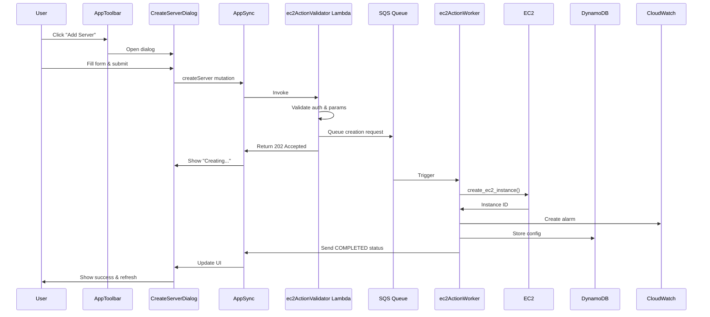

# Design Document: Server Instance Creation

## Overview

This feature adds the ability to create new Minecraft server EC2 instances directly from the dashboard interface. Users will interact with a new "Add Server" button in the toolbar that opens a dialog for configuring server specifications, naming, and shutdown policies. The implementation leverages the existing `create_ec2_instance` method in `ec2Helper.py` and follows the established asynchronous action processing pattern used throughout the application.

## Architecture

### High-Level Flow

```
User clicks "Add Server" 
  → Dialog opens with configuration form
  → User fills in: name, instance type, shutdown mechanism
  → User submits form
  → Frontend validates input
  → GraphQL mutation sent to AppSync
  → Lambda validates authorization and parameters
  → Action queued to SQS
  → Processor Lambda creates EC2 instance
  → Processor configures CloudWatch/EventBridge
  → Processor stores config in DynamoDB
  → Status updates sent via AppSync subscription
  → Frontend refreshes server list
```

### Component Interaction



## Components and Interfaces

### Frontend Components

#### 1. AppToolbar.vue (Modified)
**Purpose**: Add "Add Server" button to toolbar

**Changes**:
- Add new button next to user info section
- Button visible only to admin users
- Opens CreateServerDialog on click

**Interface**:
```vue
<v-btn 
  v-if="isAdmin" 
  @click="showCreateDialog = true"
  color="accent"
>
  <v-icon>mdi-plus</v-icon>
  Add Server
</v-btn>
```

#### 2. CreateServerDialog.vue (New)
**Purpose**: Modal dialog for configuring new server instance

**Props**:
- `visible: Boolean` - Controls dialog visibility
- `emit: ['update:visible', 'server-created']` - Events for parent communication

**Data Structure**:
```javascript
{
  serverName: '',
  instanceType: 't3.micro',
  shutdownMethod: 'CPUUtilization',
  cpuThreshold: 5.0,
  evaluationPeriod: 30,
  connectionThreshold: 0,
  startSchedule: '',
  stopSchedule: '',
  loading: false,
  errors: {}
}
```

**Validation Rules**:
- Server name: 3-50 characters, alphanumeric + hyphens + underscores
- Instance type: Must be one of supported T3 types
- CPU threshold: 0-100, decimal allowed
- Evaluation period: 1-60 minutes
- Connection threshold: 0-100 players
- Cron expressions: Valid 5-field format

**Instance Type Options**:
```javascript
const instanceTypes = [
  { value: 't3.micro', label: 'T3 Micro', cpu: '2 vCPU', memory: '1 GB', cost: '$0.0104/hr' },
  { value: 't3.small', label: 'T3 Small', cpu: '2 vCPU', memory: '2 GB', cost: '$0.0208/hr' },
  { value: 't3.medium', label: 'T3 Medium', cpu: '2 vCPU', memory: '4 GB', cost: '$0.0416/hr' },
  { value: 't3.large', label: 'T3 Large', cpu: '2 vCPU', memory: '8 GB', cost: '$0.0832/hr' },
  { value: 't3.xlarge', label: 'T3 XLarge', cpu: '4 vCPU', memory: '16 GB', cost: '$0.1664/hr' },
  { value: 't3.2xlarge', label: 'T3 2XLarge', cpu: '8 vCPU', memory: '32 GB', cost: '$0.3328/hr' }
]
```

### Backend Components

#### 1. GraphQL Schema (Modified)
**New Mutation**:
```graphql
input CreateServerInput {
  serverName: String!
  instanceType: String!
  shutdownMethod: String!
  alarmThreshold: Float
  alarmEvaluationPeriod: Int
  startScheduleExpression: String
  stopScheduleExpression: String
}

type Mutation {
  createServer(input: CreateServerInput!): AWSJSON
    @aws_cognito_user_pools
}
```

#### 2. ec2ActionValidator Lambda (Modified)
**New Handler**: `handle_create_server()`

**Responsibilities**:
- Validate user is admin
- Validate input parameters
- Queue creation request to SQS
- Return 202 Accepted with queued status

**Validation Logic**:
```python
def validate_create_server_input(input_data):
    """
    Validate server creation parameters
    
    Returns:
        tuple: (is_valid, error_message)
    """
    # Server name validation
    server_name = input_data.get('serverName', '').strip()
    if not server_name or len(server_name) < 3 or len(server_name) > 50:
        return False, "Server name must be 3-50 characters"
    
    if not re.match(r'^[a-zA-Z0-9_-]+$', server_name):
        return False, "Server name can only contain alphanumeric, hyphens, underscores"
    
    # Instance type validation
    instance_type = input_data.get('instanceType')
    allowed_types = ['t3.micro', 't3.small', 't3.medium', 't3.large', 't3.xlarge', 't3.2xlarge']
    if instance_type not in allowed_types:
        return False, f"Instance type must be one of {allowed_types}"
    
    # Shutdown method validation
    shutdown_method = input_data.get('shutdownMethod')
    if shutdown_method not in ['CPUUtilization', 'Connections', 'Schedule']:
        return False, "Invalid shutdown method"
    
    # Threshold validation
    if shutdown_method in ['CPUUtilization', 'Connections']:
        threshold = input_data.get('alarmThreshold')
        if threshold is None or threshold < 0 or threshold > 100:
            return False, "Threshold must be between 0 and 100"
        
        eval_period = input_data.get('alarmEvaluationPeriod')
        if eval_period is None or eval_period < 1 or eval_period > 60:
            return False, "Evaluation period must be between 1 and 60 minutes"
    
    # Schedule validation
    if shutdown_method == 'Schedule':
        start_schedule = input_data.get('startScheduleExpression', '').strip()
        stop_schedule = input_data.get('stopScheduleExpression', '').strip()
        
        if not start_schedule or not stop_schedule:
            return False, "Both start and stop schedules required for scheduled shutdown"
        
        # Validate cron format (basic check)
        if not _is_valid_cron(start_schedule) or not _is_valid_cron(stop_schedule):
            return False, "Invalid cron expression format"
    
    return True, None
```

#### 3. ec2ActionWorker Lambda (Modified)
**New Handler**: `process_create_server()`

**Responsibilities**:
- Extract parameters from SQS message
- Call `ec2Helper.create_ec2_instance()`
- Configure CloudWatch alarm based on shutdown method
- Create EventBridge rules if scheduled shutdown
- Store initial configuration in DynamoDB
- Send status updates to AppSync
- Handle errors and send to DLQ if needed

**Implementation Flow**:
```python
def process_create_server(message):
    """
    Process server creation request from SQS queue
    
    Args:
        message: SQS message containing creation parameters
        
    Returns:
        bool: True if successful, False to retry
    """
    try:
        # Extract parameters
        server_name = message['serverName']
        instance_type = message['instanceType']
        shutdown_method = message['shutdownMethod']
        user_email = message.get('userEmail')
        
        # Send PROCESSING status
        send_status_update('createServer', 'PROCESSING', 
                          f"Creating instance {server_name}...", user_email)
        
        # Create EC2 instance with two EBS volumes (16GB root for OS, 50GB data for game)
        instance_id = ec2_utils.create_ec2_instance(
            instance_name=server_name,
            instance_type=instance_type,
            subnet_id=None,  # Use default
            security_group_id=None  # Use default
        )
        
        if not instance_id:
            raise Exception("Failed to create EC2 instance")
        
        logger.info(f"Created instance {instance_id} with two EBS volumes")
        
        # Configure shutdown mechanism
        if shutdown_method == 'CPUUtilization':
            ec2_utils.update_alarm(
                instance_id,
                'CPUUtilization',
                message['alarmThreshold'],
                message['alarmEvaluationPeriod']
            )
        elif shutdown_method == 'Connections':
            ec2_utils.update_alarm(
                instance_id,
                'Connections',
                message['alarmThreshold'],
                message['alarmEvaluationPeriod']
            )
        elif shutdown_method == 'Schedule':
            # Create EventBridge rules
            create_schedule_rules(
                instance_id,
                message['startScheduleExpression'],
                message['stopScheduleExpression']
            )
        
        # Store configuration in DynamoDB
        config = {
            'id': instance_id,
            'shutdownMethod': shutdown_method,
            'alarmThreshold': message.get('alarmThreshold', 0.0),
            'alarmEvaluationPeriod': message.get('alarmEvaluationPeriod', 0),
            'startScheduleExpression': message.get('startScheduleExpression', ''),
            'stopScheduleExpression': message.get('stopScheduleExpression', ''),
            'runCommand': '/opt/minecraft/start.sh',  # Default
            'workDir': '/opt/minecraft',  # Default
            'timezone': 'UTC',
            'autoConfigured': False,  # User-configured
            'createdAt': datetime.now(timezone.utc).isoformat()
        }
        
        dyn.put_server_config(config)
        
        # Send COMPLETED status
        send_status_update('createServer', 'COMPLETED', 
                          f"Server {server_name} created successfully", user_email,
                          {'instanceId': instance_id})
        
        return True
        
    except Exception as e:
        logger.error(f"Error creating server: {str(e)}", exc_info=True)
        send_status_update('createServer', 'FAILED', 
                          f"Failed to create server: {str(e)}", user_email)
        return False
```

#### 4. ec2Helper.py (Modified)
**Modifications to `create_ec2_instance()`**:
- Accept `instance_type` parameter (currently hardcoded to t3.micro)
- Ensure proper tagging with App tag
- Return instance_id on success, None on failure

**Updated Signature**:
```python
def create_ec2_instance(self, instance_name, instance_type='t3.micro', 
                       subnet_id=None, security_group_id=None):
    """
    Create a new EC2 instance with specified configuration
    
    Args:
        instance_name (str): Name tag for the instance
        instance_type (str): EC2 instance type (default: t3.micro)
        subnet_id (str): Subnet ID (None for default)
        security_group_id (list): Security group IDs (None for default)
        
    Returns:
        str: Instance ID if successful, None if failed
    """
```

## Data Models

### CreateServerInput (GraphQL)
```graphql
input CreateServerInput {
  serverName: String!           # 3-50 chars, alphanumeric + - _
  instanceType: String!          # t3.micro|small|medium|large|xlarge|2xlarge
  shutdownMethod: String!        # CPUUtilization|Connections|Schedule
  alarmThreshold: Float          # 0-100, required for CPU/Connections
  alarmEvaluationPeriod: Int     # 1-60 minutes, required for CPU/Connections
  startScheduleExpression: String # Cron, required for Schedule
  stopScheduleExpression: String  # Cron, required for Schedule
}
```

### SQS Message Format
```json
{
  "action": "createServer",
  "serverName": "my-minecraft-server",
  "instanceType": "t3.medium",
  "shutdownMethod": "CPUUtilization",
  "alarmThreshold": 5.0,
  "alarmEvaluationPeriod": 30,
  "startScheduleExpression": "",
  "stopScheduleExpression": "",
  "userEmail": "admin@example.com",
  "timestamp": 1703001234
}
```

### DynamoDB ServerConfig (Initial)
```json
{
  "id": "i-1234567890abcdef0",
  "shutdownMethod": "CPUUtilization",
  "alarmThreshold": 5.0,
  "alarmEvaluationPeriod": 30,
  "startScheduleExpression": "",
  "stopScheduleExpression": "",
  "runCommand": "/opt/minecraft/start.sh",
  "workDir": "/opt/minecraft",
  "timezone": "UTC",
  "autoConfigured": false,
  "createdAt": "2024-12-18T10:30:00Z",
  "updatedAt": "2024-12-18T10:30:00Z"
}
```

## Correctness Properties

*A property is a characteristic or behavior that should hold true across all valid executions of a system-essentially, a formal statement about what the system should do. Properties serve as the bridge between human-readable specifications and machine-verifiable correctness guarantees.*

### Property 1: Dialog visibility control
*For any* user interaction with the "Add Server" button, clicking the button should change the dialog visibility state from false to true
**Validates: Requirements 1.1**

### Property 2: Instance type specifications display
*For any* instance type selection, the displayed specifications (CPU, memory, cost) should match the AWS T3 instance specifications for that type
**Validates: Requirements 2.2**

### Property 3: Instance type cost display
*For any* selected instance type, the system should display the correct estimated hourly cost
**Validates: Requirements 2.3**

### Property 4: Conditional shutdown field display
*For any* shutdown mechanism selection (CPU-based, connection-based, or scheduled), the system should show and enable only the appropriate configuration fields
**Validates: Requirements 3.2, 3.3, 3.4**

### Property 5: Server name length validation
*For any* server name input, the system should reject names that are not between 3 and 50 characters
**Validates: Requirements 4.2**

### Property 6: Server name character validation
*For any* server name input, the system should reject names containing characters other than alphanumeric, hyphens, and underscores
**Validates: Requirements 4.3**

### Property 7: Invalid name error display
*For any* invalid server name, the system should display validation error messages
**Validates: Requirements 4.4**

### Property 8: Form submission prevention
*For any* invalid server name, the system should prevent form submission
**Validates: Requirements 4.5**

### Property 9: Shutdown parameter validation
*For any* shutdown mechanism configuration, the system should validate that required parameters are present and within valid ranges before allowing submission
**Validates: Requirements 3.5**

### Property 10: Ubuntu AMI usage
*For any* server creation request, the system should use the latest Ubuntu 22.04 AMI
**Validates: Requirements 5.1**

### Property 11: EBS volume configuration
*For any* server creation request, the system should configure two EBS volumes (16GB root volume for OS, 50GB data volume for game)
**Validates: Requirements 5.2**

### Property 12: Instance tagging
*For any* server creation request, the system should apply appropriate tags including Name and App values
**Validates: Requirements 5.3**

### Property 13: IAM profile assignment
*For any* server creation request, the system should assign the correct IAM instance profile
**Validates: Requirements 5.4**

### Property 14: Network placement
*For any* server creation request, the system should place the instance in the default subnet and security group
**Validates: Requirements 5.5**

### Property 15: CloudWatch alarm creation
*For any* server created with CPU-based or connection-based shutdown, the system should create a CloudWatch alarm with the specified threshold and evaluation period
**Validates: Requirements 6.1**

### Property 16: EventBridge rule creation
*For any* server created with scheduled shutdown, the system should create both start and stop EventBridge rules with the specified cron expressions
**Validates: Requirements 6.2**

### Property 17: Configuration persistence
*For any* successfully created server, the system should store the complete configuration in DynamoDB
**Validates: Requirements 6.3**

### Property 18: Status update propagation
*For any* server creation operation, the system should send status updates (PROCESSING, COMPLETED, or FAILED) via AppSync subscriptions
**Validates: Requirements 6.4**

### Property 19: UI refresh after creation
*For any* successful server creation, the dashboard should automatically refresh to display the new server in the list
**Validates: Requirements 1.4, 6.5**

### Property 20: UI error handling
*For any* server creation failure, the dashboard should display an error message with details
**Validates: Requirements 1.5**

## Error Handling

### Frontend Error Scenarios

1. **Validation Errors**
   - Display inline error messages for invalid inputs
   - Prevent form submission until all errors resolved
   - Highlight invalid fields in red

2. **Network Errors**
   - Show toast notification with retry option
   - Keep dialog open with form data preserved
   - Log error details to console

3. **Authorization Errors**
   - Display "Insufficient permissions" message
   - Close dialog and redirect if session expired
   - Suggest contacting admin if not authorized

### Backend Error Scenarios

1. **Invalid Input**
   - Return 400 Bad Request with specific error message
   - Log validation failure details
   - Do not queue to SQS

2. **Authorization Failure**
   - Return 401 Unauthorized
   - Log attempted unauthorized access
   - Do not queue to SQS

3. **EC2 Creation Failure**
   - Send FAILED status via AppSync
   - Log full error details including AWS error codes
   - Message sent to DLQ for manual review
   - Notify user of failure with actionable message

4. **Configuration Failure**
   - Attempt to delete created instance (cleanup)
   - Send FAILED status via AppSync
   - Log error and send to DLQ
   - Notify user that instance may need manual cleanup

5. **DynamoDB Failure**
   - Instance exists but config not stored
   - Send WARNING status via AppSync
   - Log error for manual intervention
   - Instance will be auto-configured on next ec2Discovery call

## Testing Strategy

### Unit Tests

**Frontend (Vitest)**:
- CreateServerDialog component rendering
- Form validation logic
- Instance type selection and display
- Error message display
- Dialog open/close behavior

**Backend (pytest)**:
- Input validation functions
- Admin authorization check
- SQS message formatting
- Error response formatting

### Property-Based Tests

Property-based tests will use **Hypothesis** for Python backend testing and **fast-check** for JavaScript frontend testing. Each test will run a minimum of 100 iterations.

**Backend Properties**:
1. Server name validation rejects invalid inputs
2. Instance type validation accepts only T3 types
3. Shutdown configuration validation enforces required fields
4. SQS message contains all required fields
5. Admin-only operations reject non-admin users

**Frontend Properties**:
1. Form validation prevents submission with invalid data
2. Instance type selection updates specifications correctly
3. Shutdown method selection shows/hides appropriate fields

### Integration Tests

- End-to-end server creation flow (requires AWS sandbox)
- GraphQL mutation execution
- SQS queue processing
- DynamoDB storage verification
- CloudWatch alarm creation verification

### Manual Testing Checklist

- [ ] Admin user can see "Add Server" button
- [ ] Non-admin user cannot see "Add Server" button
- [ ] Dialog opens when button clicked
- [ ] All form fields render correctly
- [ ] Instance type dropdown shows all T3 options
- [ ] Shutdown method selection updates form fields
- [ ] Form validation prevents invalid submission
- [ ] Valid submission shows loading state
- [ ] Success message appears after creation
- [ ] New server appears in server list
- [ ] CloudWatch alarm created correctly
- [ ] EventBridge rules created for scheduled shutdown
- [ ] DynamoDB config stored correctly
- [ ] Error handling works for various failure scenarios

## Security Considerations

1. **Authorization**
   - Only admin users can create servers
   - Verify admin group membership in Lambda
   - Log all creation attempts with user email

2. **Input Validation**
   - Sanitize server name to prevent injection
   - Validate all numeric inputs are within bounds
   - Validate cron expressions before creating EventBridge rules

3. **Resource Limits**
   - Consider implementing rate limiting for server creation
   - Monitor for abuse patterns (many failed creations)
   - Set CloudWatch alarms for unusual EC2 launch patterns

4. **IAM Permissions**
   - Lambda needs ec2:RunInstances permission
   - Lambda needs iam:PassRole for instance profile
   - Lambda needs cloudwatch:PutMetricAlarm permission
   - Lambda needs events:PutRule and events:PutTargets permissions

## Performance Considerations

1. **Asynchronous Processing**
   - Server creation queued to SQS (non-blocking)
   - User receives immediate feedback (202 Accepted)
   - Actual creation happens in background

2. **Status Updates**
   - Real-time updates via AppSync subscriptions
   - User sees progress without polling

3. **Dialog Responsiveness**
   - Form validation runs client-side (instant feedback)
   - No API calls until submission
   - Loading states prevent duplicate submissions

4. **EC2 Instance Launch Time**
   - Typical launch time: 2-3 minutes
   - User informed of expected wait time
   - Status updates keep user engaged

## Future Enhancements

1. **Advanced Configuration**
   - Custom AMI selection
   - Custom security group selection
   - Custom subnet selection
   - Multiple EBS volume configuration

2. **Templates**
   - Save server configurations as templates
   - Quick create from template
   - Share templates between admins

3. **Batch Creation**
   - Create multiple servers at once
   - Apply same configuration to multiple instances

4. **Cost Estimation**
   - Show estimated monthly cost before creation
   - Factor in instance type, storage, and expected runtime

5. **Validation Improvements**
   - Check AWS service quotas before creation
   - Validate subnet/security group availability
   - Check for name conflicts with existing servers