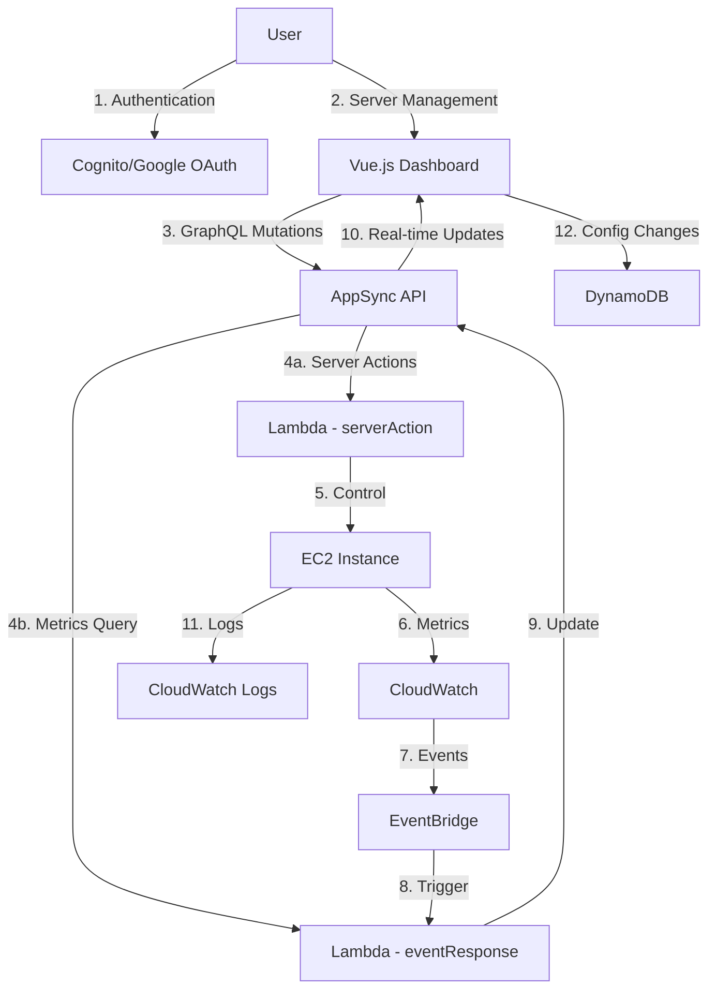

# Minecraft Server Dashboard - Easily Manage AWS-Hosted Minecraft Servers

A web-based dashboard that provides real-time monitoring and management of Minecraft servers running on AWS EC2 instances. This solution enables users to start, stop, configure, and monitor their Minecraft servers through an intuitive interface while optimizing costs through automated shutdown policies.

The dashboard offers comprehensive server management capabilities including:
- Real-time server metrics monitoring (CPU, memory, network usage, active players)
- One-click server start/stop/restart controls
- Automated cost optimization through configurable shutdown policies
- Server configuration management including run commands and working directories
- User access management with Google authentication
- CloudWatch integration for performance monitoring and automated alerts
- IAM role management to ensure proper server permissions

The application is built using Vue.js for the frontend, AWS AppSync for real-time data synchronization, and various AWS services (Lambda, EC2, CloudWatch, etc.) for the backend infrastructure. It uses a serverless architecture to minimize operational overhead while providing scalability and reliability.

## Repository Structure
```
├── amazon-cloudwatch-agent.json   # CloudWatch agent configuration for metrics collection
├── amplify/                      # Amplify backend configuration and API definitions
├── appsync/                      # AppSync GraphQL schema and resolver implementations
├── cfn/                         # CloudFormation templates for AWS infrastructure
│   ├── template.yaml            # Main CloudFormation template
│   └── templates/               # Nested templates for different components
├── dashboard/                   # Vue.js frontend application
│   ├── src/                    # Source code for the dashboard UI
│   └── components/             # Reusable Vue components
├── lambdas/                    # Lambda functions for server management
│   ├── configServer/           # Server configuration handler
│   ├── eventResponse/          # Event processing for EC2 state changes
│   └── serverAction/           # Server control actions implementation
└── layers/                     # Shared Lambda layers for common functionality
    ├── authHelper/             # Authentication utilities
    ├── dynHelper/             # DynamoDB interaction helpers
    └── ec2Helper/             # EC2 management utilities
```

## Usage Instructions
### Prerequisites
- AWS Account with appropriate permissions
- Node.js 14+ for frontend development
- Python 3.9+ for Lambda functions
- AWS SAM CLI for deployment
- AWS Amplify CLI
- Google OAuth credentials for authentication

### Installation
1. Clone the repository:
```bash
git clone <repository-url>
cd minecraft-server-dashboard
```

2. Install frontend dependencies:
```bash
cd dashboard
npm install
```

3. Configure AWS credentials:
```bash
aws configure
```

4. Deploy the infrastructure:
```bash
sam build
sam deploy --guided
```

### Quick Start
1. Set up Google OAuth credentials:
```bash
# Store Google credentials in SSM Parameter Store
aws ssm put-parameter --name /minecraft/GOOGLE_CLIENT_ID --value <your-client-id> --type SecureString
aws ssm put-parameter --name /minecraft/GOOGLE_SECRET --value <your-client-secret> --type SecureString
```

2. Start the development server:
```bash
cd dashboard
npm run dev
```

3. Access the dashboard at http://localhost:5173

### More Detailed Examples
1. Creating a new Minecraft server:
```javascript
// Using the dashboard UI
await serverStore.triggerAction('startServer', {
  instanceId: 'i-1234567890abcdef0'
});
```

2. Configuring automatic shutdown:
```javascript
// Set CPU utilization threshold
await serverStore.putServerConfig({
  id: 'i-1234567890abcdef0',
  shutdownMethod: 'CPUUtilization',
  alarmThreshold: 10,
  alarmEvaluationPeriod: 15
});
```

### Troubleshooting
1. IAM Role Issues
- Problem: Server shows "IAM role not compliant" error
- Solution: Click the "Fix it" button in the dashboard or run:
```bash
aws lambda invoke --function-name <function-name> --payload '{"action":"fixServerRole","instanceId":"i-xxx"}' response.json
```

2. CloudWatch Agent Not Reporting
- Check agent status:
```bash
aws ssm send-command --instance-ids i-xxx --document-name "AmazonCloudWatch-ManageAgent" --parameters '{"action":["status"],"mode":["ec2"]}'
```
- Review logs at `/opt/aws/amazon-cloudwatch-agent/logs/amazon-cloudwatch-agent.log`

## Data Flow
The dashboard implements a real-time monitoring and control system for Minecraft servers.

```ascii
User Request → API Gateway → AppSync → Lambda Functions → EC2/CloudWatch
     ↑                          ↓
Real-time Updates ← CloudWatch Events ← Server Metrics/State Changes
```



Key component interactions:
1. User authentication through Cognito with Google OAuth integration
2. Dashboard interface for server management and monitoring
3. GraphQL API handling all server operations
4. Lambda functions processing server actions and metrics
5. EC2 instance management and control
6. CloudWatch collecting server metrics
7. EventBridge processing state changes
8. Lambda processing metrics and events
9. Real-time updates through AppSync subscriptions
10. Live dashboard updates
11. Server logs collection
12. Configuration storage in DynamoDB

## Infrastructure


### Lambda Functions
- configServer: Handles server initialization and configuration
- eventResponse: Processes EC2 state changes and metrics
- serverAction: Manages server start/stop/restart operations
- getMonthlyCost: Retrieves cost metrics

### Cognito
- UserPool: Manages user authentication
- IdentityPool: Provides AWS credentials
- Google OAuth integration

### CloudFront/S3
- WebAppBucket: Hosts the Vue.js dashboard
- CloudFront distribution: Serves the web application

### AppSync
- GraphQL API with real-time subscriptions
- DynamoDB data sources
- Custom resolvers for server management

## Deployment
1. Prerequisites:
- AWS SAM CLI installed
- AWS credentials configured
- Google OAuth credentials

2. Deploy infrastructure:
```bash
sam build
sam deploy --guided
```

3. Deploy frontend:
```bash
cd dashboard
npm run build
aws s3 sync dist/ s3://<web-bucket-name>
```

4. Configure CloudWatch agent:
```bash
aws ssm put-parameter --name AmazonCloudWatch-Config --type String --value file://amazon-cloudwatch-agent.json
```