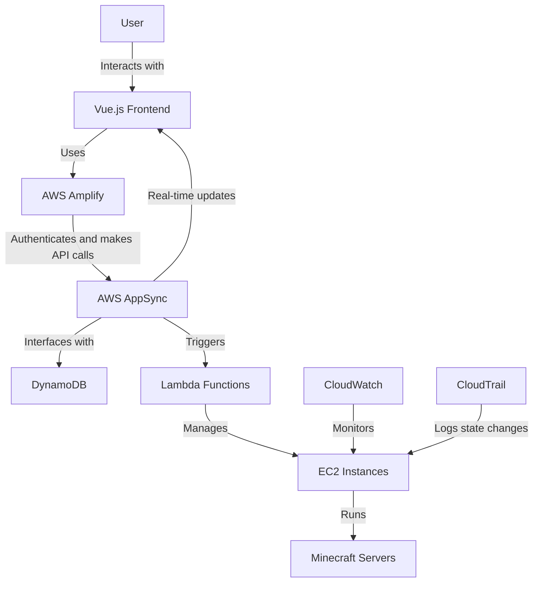
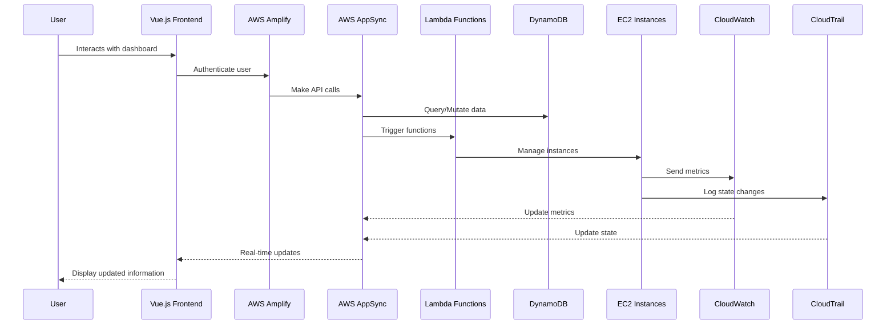

## Minecraft Server Dashboard

This solution builds a real-time Minecraft Server dashboard using AWS Amplify and AWS Appsync to manage  Minecraft Servers deployed on Amazon Elastic Compute Cloud (EC2). 

Details about the solution can be found at the [DIY Minecraft Dashboad](https://medium.com/@arturlr/diy-minecraft-dashboard-to-manage-your-kids-games-a2d84e828f82) blog post.

## Stack

* **Front-end** - Vue.js as the core framework, [Vuetify](https://vuetifyjs.com/en/) for UI, [ApexCharts](https://apexcharts.com/) for the charts, [AWS Amplify](https://aws.amazon.com/amplify/) for Auth UI component and AWS integration. 
* **Data** - User data is saved in [Amazon DynamoDB](https://aws.amazon.com/dynamodb/) via GraphQL using [AWS AppSync](https://aws.amazon.com/appsync/). EC2 information comes from Amazon CloudWatch metrics, Log Insights, Amazon Cloud Explorer and Amazon CloudTrail. 
* **Auth** - [Amazon Cognito](https://aws.amazon.com/cognito/) federated with GMail. It provides JSON Web Tokens (JWT) and along with AppSync fine-grained authorization on what data types users can access.

## User Interface


## Deployment Guide

To deploy this solution into your AWS Account please follow our [Deployment Guide](docs/deployment_guide.md)

## User Guide

Information in how to use and configure the solution at the [User Guide](docs/user_guide.md)

## Data Flow

1. User interacts with the Vue.js frontend, which uses AWS Amplify for authentication and API calls.
2. AWS AppSync handles GraphQL queries and mutations, interfacing with DynamoDB for data storage.
3. Lambda functions are triggered for various operations, such as starting/stopping EC2 instances, updating alarms, and retrieving server metrics.
4. EC2 instances run Minecraft servers, with CloudWatch monitoring their performance.
5. CloudTrail logs EC2 instance state changes, which are used to calculate running time.
6. The dashboard updates in real-time using AppSync subscriptions for server metrics and state changes.

## Data Flow Diagram



## Sequence Diagram



## Repository Structure

```
.
├── appsync/
│   └── resolvers/         # AppSync resolver functions
├── dashboard/
│   ├── src/
│   │   ├── graphql/       # GraphQL queries, mutations, and subscriptions
│   │   ├── router/        # Vue Router configuration
│   │   └── stores/        # Pinia stores for state management
│   ├── package.json       # Frontend dependencies
│   └── vite.config.js     # Vite configuration
├── lambdas/               # Lambda functions for various operations
├── layers/                # Lambda layers for shared code
│   ├── authHelper/
│   ├── dynHelper/
│   ├── ec2Helper/
│   └── utilHelper/
├── tests/                 # Test files
├── docs/                  # Documentation
└── README.md              # Project overview
```

## Troubleshooting

1. **Authentication Issues**
   - Ensure Cognito is properly configured with the correct user pool and app client.
   - Check if the JWT token is being correctly passed in API requests.

2. **GraphQL Errors**
   - Verify that the AppSync schema matches the frontend queries and mutations.
   - Check the AppSync console for any resolver errors or data source issues.

3. **Lambda Function Failures**
   - Review CloudWatch logs for specific Lambda function errors.
   - Ensure IAM roles have the necessary permissions for accessing required AWS services.

4. **EC2 Instance Management Problems**
   - Verify that the EC2 instances have the correct tags for identification.
   - Check if the IAM roles associated with the instances have the required permissions.

5. **Real-time Updates Not Working**
   - Ensure that AppSync subscriptions are properly set up and connected.
   - Check for any network issues that might be preventing WebSocket connections.

6. **Dashboard Data Discrepancies**
   - Verify that CloudWatch metrics and Log Insights queries are correctly configured.
   - Ensure that the correct time ranges are being used for data retrieval.

If issues persist, consult the AWS documentation for the specific services involved or reach out to AWS support for further assistance.

## Security

See [CONTRIBUTING](CONTRIBUTING.md) for more information.
## License

This library is licensed under the MIT-0 License. See the [LICENSE](LICENSE) file.