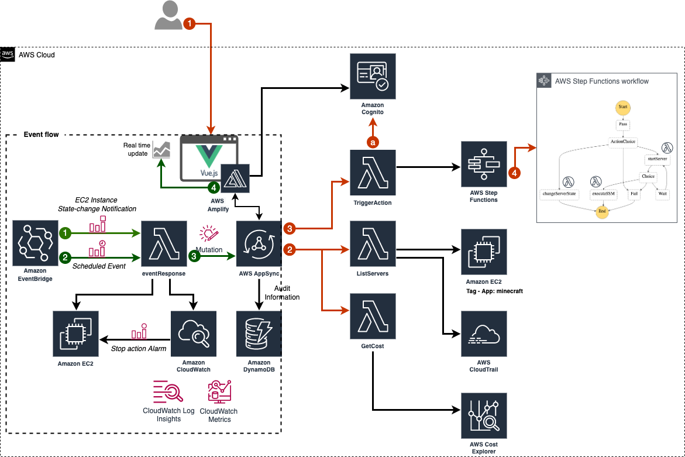

## Minecraft Server Dashboard

This solution builds a real-time Minecraft Server dashboard using AWS Amplify and AWS Appsync to manage  Minecraft Servers deployed on Amazon Elastic Compute Cloud (EC2). 

AWS [AppSync](https://aws.amazon.com/appsync/) is a fully managed service that allows to deploy Serverless GraphQL backends in the AWS cloud, and it also allows me to create real-time application by automatically publishing data updates to GraphQL subscribed API clients via serverless WebSockets connections. With built-in support for WebSockets, AppSync can seamlessly push data to clients from any backend, including EC2 instances state-change events, metric information from Amazon CloudWatch metrics, and Amazon CloudWatch log insights query results.

Another advantage of using AWS AppSync is that can use AWS Lambda with AWS AppSync to resolve any GraphQL field for queries and mutations. This approach is so versatile and powerful that even a simple click of a button to start the server is associated with an AWS Lambda resolver, as it leverages the integration with Amazon Cognito and sends the authentication token along with the call.

[AWS Amplify](https://docs.amplify.aws/) provides libraries and declarative interfaces that enables seamless integration from your front-end application with AWS Services. The Minecraft Dashboard heavily rely on the GraphQL integration AWS Amplify provides.

## Architecture Overview

### User Interaction flow (red) 

1. User connects to the application using a Gmail account 

2. The app invokes ListServers and GetCost AWS Lambda Functions based no AppSync queries. ListServers returns all servers' settings of instances tagged with App: minecraft. The GetCost AWS Lambda send us back the total cost and hours associated with all instances that contains the tag App: minecraft.  

3. When the user selects presses the power button icon, it calls the TriggerAction AWS Lambda that verifies if the user is authorized using Amazon Cognito groups to call an AWS Step Functions Workflow.  

4. The AWS function verifies if there is an Amazon Cognit group named with the EC2 instanceId. In case the 4.group does not exist, and the user who invoked is the Administrator, then group gets created. This group is used to grant permission to other users to start/stop the server.  

5. During an EC2 Instance Start, the workflow awaits both systemStatus and instanceStatus to be ok to move to the next step to executes an AWS System Manager RunCommand to start the Minecraft Server.  

### Event flow (green) 

1. When an EC2 Instance states changes, it triggers the EventResponse AWS Lambda, which validates the event. It also verifies how many machines with the App: minecraft tag are running. in case of no Minecraft servers are running, and this is the first instance brough on-line, the AWS Lambda enables a scheduled event rule, which is disabled by default. As part of the process of starting the server, an Amazon CloudWatch alarm stop actions is created and associated with the instance; it stops the server automatically based on pre-defined (on code) network traffic out metric values.  

2. The Scheduled rule runs every two minutes and collects Amazon CloudWatch Metric and users active based on CloudWatch Log insight queries. 

3. Both EC2 instance state change and metrics are sent to AppSync as mutation 

4. The system has two subscribers, one for the EC2 instance state change and another to the instance metrics. As AppSync processes the mutation for each one these events, the correspondent subscriber pick-up the information and automatically update it at the Dashboard.
## Stack

* **Front-end** - Vue.js as the core framework, [Vuetify](https://vuetifyjs.com/en/) for UI, [ApexCharts](https://apexcharts.com/) for the charts, [AWS Amplify](https://aws.amazon.com/amplify/) for Auth UI component and AWS integration. 
* **Data** - User data is saved in [Amazon DynamoDB](https://aws.amazon.com/dynamodb/) via GraphQL using [AWS AppSync](https://aws.amazon.com/appsync/). EC2 information comes from Amazon CloudWatch metrics, Log Insights, Amazon Cloud Explorer and Amazon CloudTrail. 
* **Auth** - [Amazon Cognito](https://aws.amazon.com/cognito/) federated with GMail. It provides JSON Web Tokens (JWT) and along with AppSync fine-grained authorization on what data types users can access.

## User Interface

## Deployment Guide

To deploy this solution into your AWS Account please follow our [Deployment Guide](docs/deployment_guide.md)

## Security

See [CONTRIBUTING](CONTRIBUTING.md) for more information.
## License

This library is licensed under the MIT-0 License. See the [LICENSE](LICENSE) file.