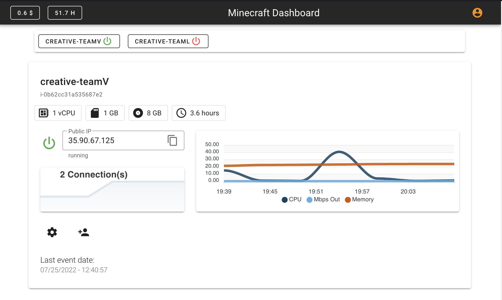

## Minecraft Server Dashboard

This solution builds a real-time Minecraft Server dashboard using AWS Amplify and AWS Appsync to manage  Minecraft Servers deployed on Amazon Elastic Compute Cloud (EC2). 

Details about the solution can be found at the [DIY Minecraft Dashboad](https://medium.com/@arturlr_49315/diy-minecraft-dashboard-to-manage-your-kids-games-5753273a1fed) blog post.

## Stack

* **Front-end** - Vue.js as the core framework, [Vuetify](https://vuetifyjs.com/en/) for UI, [ApexCharts](https://apexcharts.com/) for the charts, [AWS Amplify](https://aws.amazon.com/amplify/) for Auth UI component and AWS integration. 
* **Data** - User data is saved in [Amazon DynamoDB](https://aws.amazon.com/dynamodb/) via GraphQL using [AWS AppSync](https://aws.amazon.com/appsync/). EC2 information comes from Amazon CloudWatch metrics, Log Insights, Amazon Cloud Explorer and Amazon CloudTrail. 
* **Auth** - [Amazon Cognito](https://aws.amazon.com/cognito/) federated with GMail. It provides JSON Web Tokens (JWT) and along with AppSync fine-grained authorization on what data types users can access.

## User Interface

## Deployment Guide

To deploy this solution into your AWS Account please follow our [Deployment Guide](docs/deployment_guide.md)

## Security

See [CONTRIBUTING](CONTRIBUTING.md) for more information.
## License

This library is licensed under the MIT-0 License. See the [LICENSE](LICENSE) file.