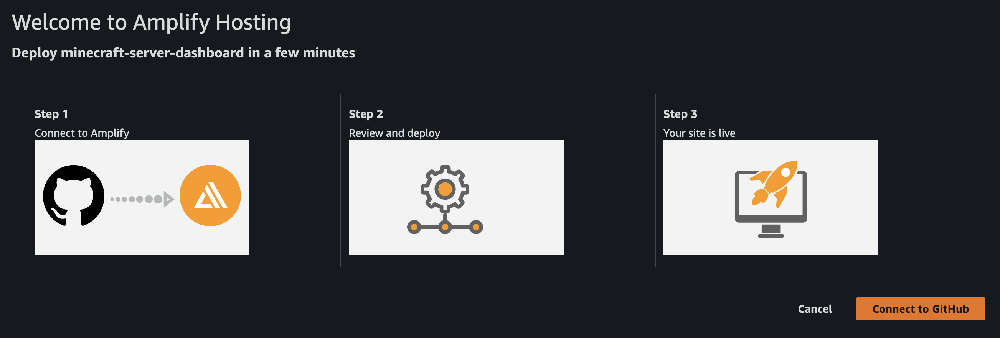
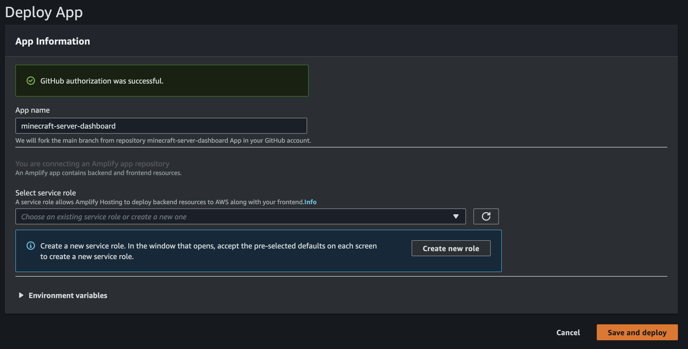
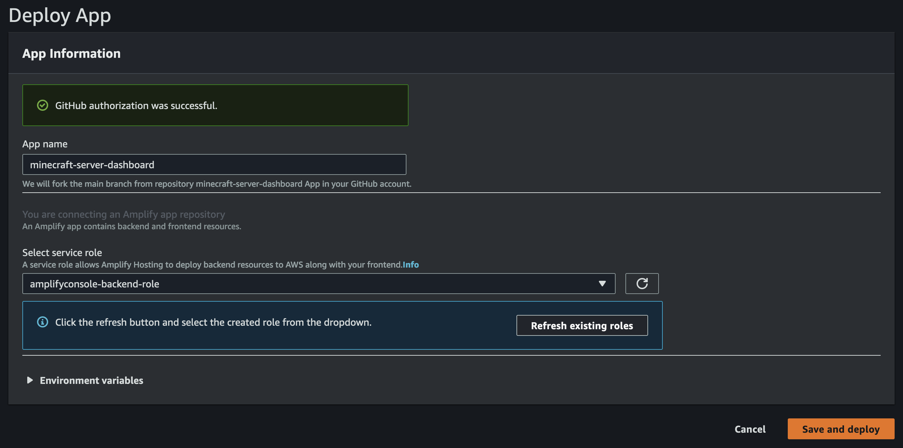
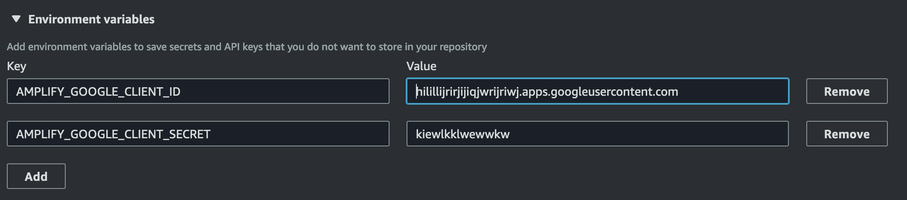
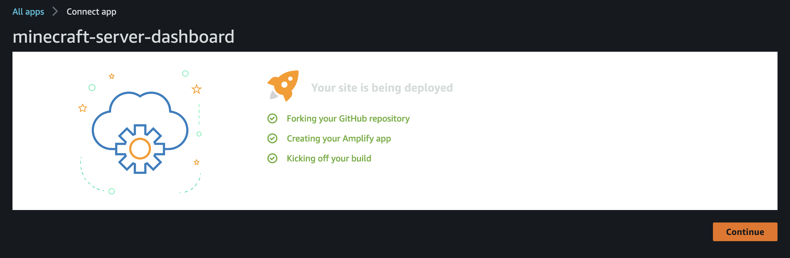
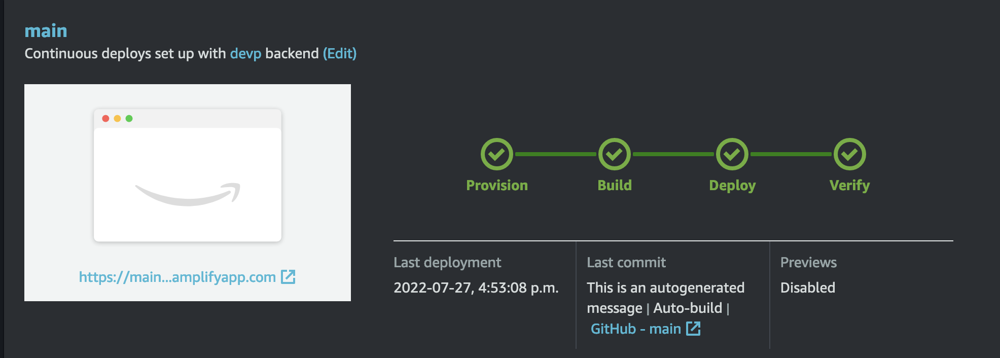
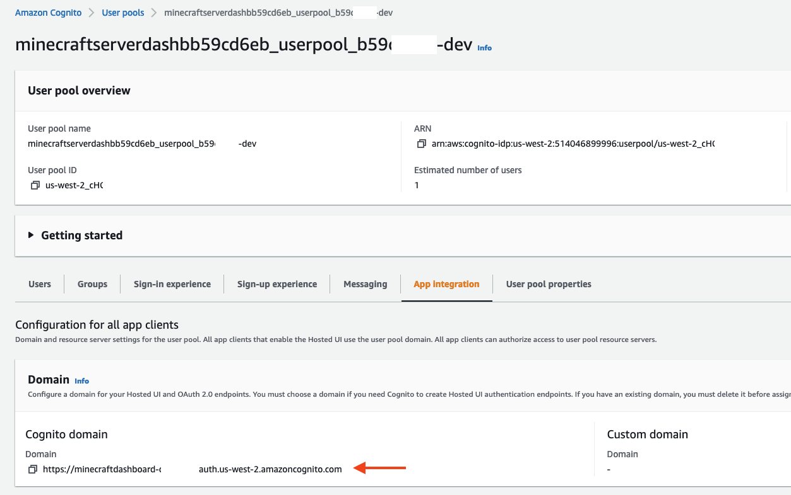

# Deployment Guide
## Requirements
Before you deploy, you must have the following in place:
*  [AWS Account](https://aws.amazon.com/account/) 
*  [GitHub Account](https://github.com/) 
*  [AWS CLI](https://aws.amazon.com/cli/) 
*  [AWS SAM](https://aws.amazon.com/serverless/sam/) 


## Step 1: Setup the Auth Provider (Google)

If your don't have a Google OAuth client and secret key, please, follow these instructions:

1.	Go to [Google developer console](https://console.developers.google.com)
2.  Click select a project
	
3.  Click SELECT A PROJECT and then NEW PROJECT
   
4.  Type in project name and click CREATE
	
5.  Once the project is created, from the left Navigation menu, select APIs & Services, then select Credentials
	
6.  Click CONFIGURE CONSENT SCREEN
	
7.  Click CREATE
	
8.  Type in App Information and Developer contact information which are required field and click SAVE AND CONTINUE three times (OAuth consent screen -> Scopes -> Test Users) to finish setting up consent screen.
9. Back to Credentials tab, Create your OAuth2.0 credentials by choosing OAuth client ID from the Create credentials drop-down list.
	
10. Choose Web application as Application type and name your OAuth Client.
11. Click Create.
12. Take note of Your **client ID** and Your **Client Secret**. You will need them for the next section.
13. Choose OK.
 
## Step 2: Front-end deployment

The **Deploy to Amplify Console** button will take you to your AWS console to deploy the front-end solution.

<a href="https://console.aws.amazon.com/amplify/home#/deploy?repo=https://github.com/arturlr/minecraft-server-dashboard">
    
</a>


The follow screenshots shows how simple this step is:

1. When you click at the button above, please make sure AWS Amplify hosting opens into the context of your AWS Account Console in your browser. You will be presented with the page below asking to connect to your Github account. Amplify will fork the Minecraft dashboard to deploy it.
   
   

2. To deploy the solution you need to create an Amplify Role with the proper policies. You will be seeing a screen similar to the image below

   2.1. click on **Create new role button**. It will open a new tab in your browser with a pre-defined role configuration for an Amplify IAM Role.

   2.2. After creating the role, still at the AWS IAM console, search for the role name you created for amplify and select the role. Once you have the role selected, go to **Add permissions** -> **Create a in-line policy**. Click at the *JSON* tab and paste the JSON IAM policy below. Click at *Review policy*, give the policy a name (e.g. minecraft-amplify-policy) and then click create policy. The policy will be automatically attached to the role.

   ```json
   {
    "Version": "2012-10-17",
    "Statement": [
        {
            "Sid": "ssmTag",
            "Effect": "Allow",
            "Action": "ssm:AddTagsToResource",
            "Resource": "arn:aws:ssm:*:*:parameter/amplify/*"
        },
        {
            "Sid": "CognitoUpdate",
            "Effect": "Allow",
            "Action": "cognito-idp:UpdateUserPoolClient",
            "Resource": "arn:aws:cognito-idp:*:*:userpool/*"
        }
    ]
   }
   ```

   2.3. Now you just created the IAM Role you need to select it. In the field **Select service role** select the role name just created, if the role is not avalable click on the refresh icon and then select the IAM Role.

To deploy the solution you need to select an Amplify Role. click at **Create new role** button. It will open a new tab in your browser with a pre-defined role configuration for an Amplify IAM Role. Accept all the default options until the IAM role is created and move to the next step
   
   

1. The Deploy App configuration should now have the IAM Role as the picture below. If not click on the refresh icon and select the IAM Role. Next step is to configure the **Enviroment variables**:
     
    a. **AMPLIFY_GOOGLE_CLIENT_ID** with the *Google Client ID YOU OBTAINED IN STEP 1*

    b. **AMPLIFY_GOOGLE_CLIENT_SECRET** with *Google Client Secret YOU OBTAINED IN STEP 1*

    This is how Amplify passes this configuration along to Amazon Cognito.    
   
   


2. After you have all the configuration done for the deployment, Amplify will fork the Github repo, create the app in Amplify and kicks-off the application deployment.
   
   

3. The deployment will take a few minutes. The green icons of the CI/CD deployment process indicates that the solution deploy successfuly. The Dashboard URL below of the image of a window with the Amazon icon on it. It wont work yet as we still have some configuraton to do.
   


## Step 3: Back-end deployment

For this step you will need a machine with bash shell, AWS CLI, Python and AWS SAM. You can use your equipment, a EC2 instance, a Clpud 9 instance. Execute the commands below using the bash under an IAM user who has permission on your AWS Account. More information at: [AWS CLI Configuration basics](https://docs.aws.amazon.com/cli/latest/userguide/cli-configure-quickstart.html)

In this step we create the various AWS Lambda Functions that interact with AppSync and the fetches the information from the EC2 Server, the AWS Step-Functions that coordinates the instance start/stop, the AWS Systems Manager Parameter that holds the Amazon Cloudwatch agent configuration, the Amazon DynamoDb used to store the instance alarm's configuration and Minecraft initialization commands and the IAM Role that is associated with the instance at the instance start.

The backend relies on resources that needed to be created during the front-end deployment, please make sure to proceed after Amplify has successfully deployed the application.

The first step is to clone the repo. 
```bash
git clone git@github.com:arturlr/minecraft-server-dashboard.git 
```
or
```bash
git clone https://github.com/arturlr/minecraft-server-dashboard.git
```

The AWS Lambdas have some libraries dependencies. The following commands instructs SAM to build all the dependencies using a local container. The command below requires you to have docker running. If you prefer to compile the code on your own machine you can only run *sam build*

```bash
sam build --use-container --build-image amazon/aws-sam-cli-build-image-python3.8
```

After executing it, you will know that it succeeded when finishing with the message below:

```bash
Build Succeeded

Built Artifacts  : .aws-sam/build
Built Template   : .aws-sam/build/template.yaml
```

To deploy the solution you execute the command below. It will guide you by asking deployment information.

```bash
sam deploy --guided
```

The output should be similar to the example below. **YOU MUST PROVIDE A GMAIL ACCOUNT AT THE PARAMETER ADMIN EMAIL** that will be used to log as the admin, otherwise you won't be able to do anything at the dashboard.

```bash
Configuring SAM deploy
======================

	Looking for config file [samconfig.toml] :  Not found

	Setting default arguments for 'sam deploy'
	=========================================
	Stack Name [sam-app]: minecraft-dasboard-backend
	AWS Region [us-west-2]: THE_REGION_OF_DEPLOYMENT
	Parameter ProjectName [minecraft-dashboard]:
	Parameter AppValue [minecraft]:
	Parameter AdminEmail []: YOUR_GMAIL_ACCOUNT@gmail.com
	#Shows you resources changes to be deployed and require a 'Y' to initiate deploy
	Confirm changes before deploy [y/N]: y
	#SAM needs permission to be able to create roles to connect to the resources in your template
	Allow SAM CLI IAM role creation [Y/n]: y
	#Preserves the state of previously provisioned resources when an operation fails
	Disable rollback [y/N]: y
	Save arguments to configuration file [Y/n]: y
	SAM configuration file [samconfig.toml]:
	SAM configuration environment [default]:
```

Confirm the deploy of the changeset and wait for the to finish. At the end you should see a message like:

```
Successfully created/updated stack - minecraft-dasboard-backend in AWS_REGION_OF_DEPLOYMENT
```

## Step 4: Allowing Amazon Cognito authenticate into Google Federation

1. Go to the AWS Console and select the Cognito User Pool at the region the application was deployed and select the one that starts with **minecraftdasboard**.
2. Select the tab **App Integration** and copy the cognito domain URL.
   
3. Go to [Google developer console](https://console.developers.google.com)

4. On the left navigation bar, choose Credentials.

5. Select the client you created in the first step and click the edit button.

6. Paste your user pool domain into **Authorized Javascript origins**.

7. Paste your user pool domain with the /oauth2/idpresponse endpoint into **Authorized Redirect URIs**.
   


## Step 5: Launching your application

1. Go to the AWS Console and select AWS Amplify at the region the application was deployed and select the **minecraftdasboard** app.
2. Click on **Domain management** at the left pannel.
3. Copy the URL and paste in a browser. Start using the application. You can also share it with your firends.
4. Optionally, if you own a DNS domain you can create a customized domain for your Amplify App. It will require you to change the Amazon Cognito clients configuration to add the new URL for CallBack and signOut. 

