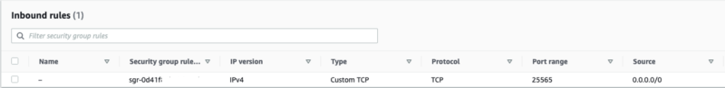
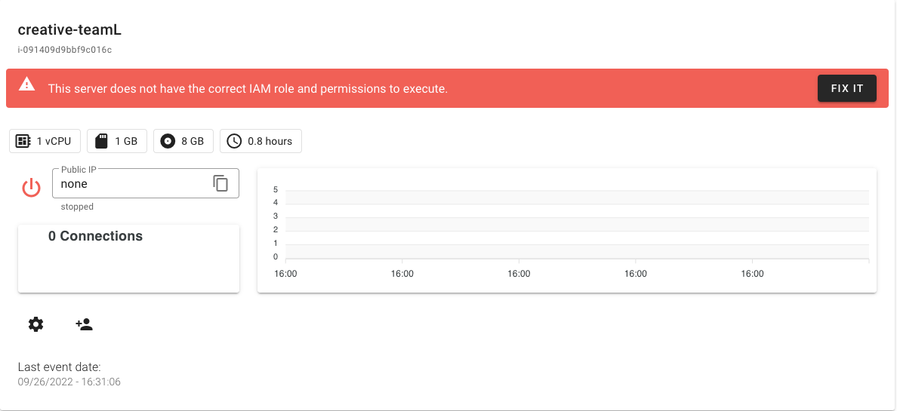
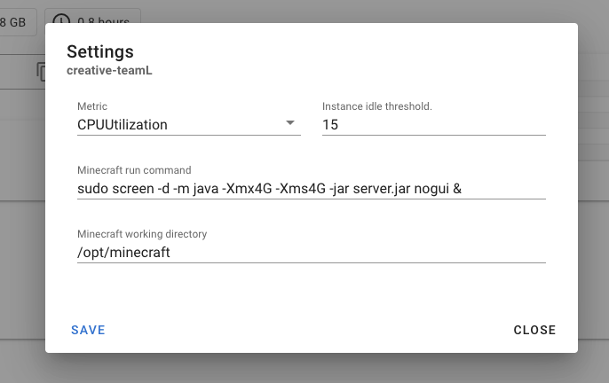
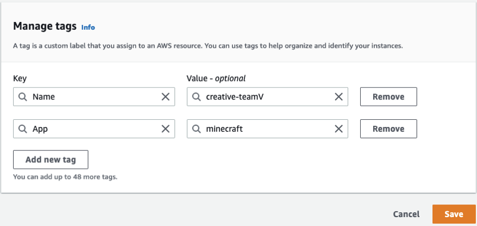
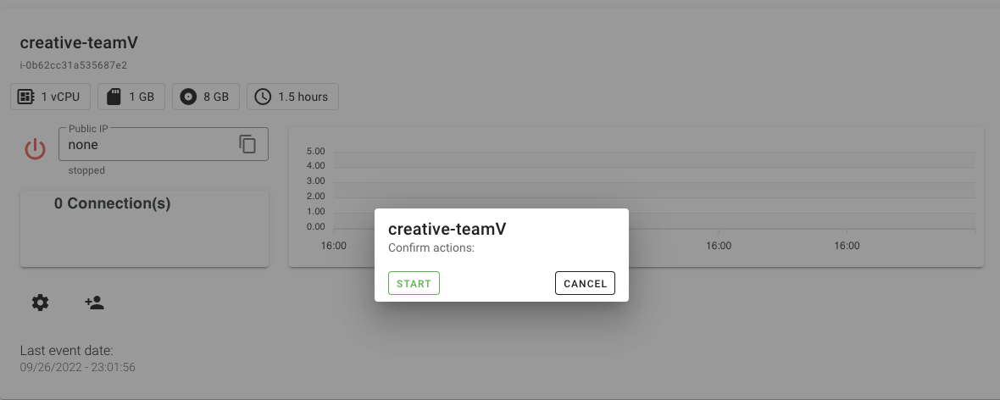
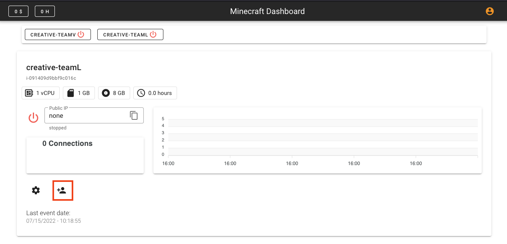
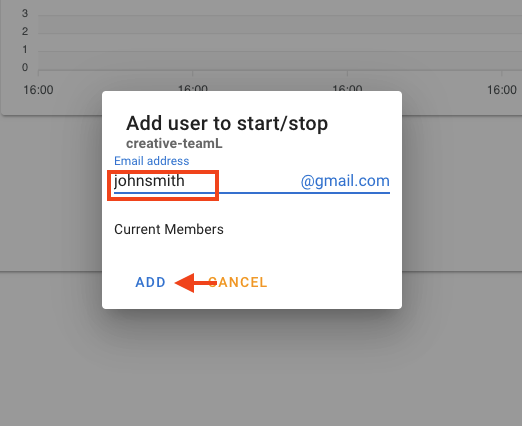

# User Guide

## Setting up the Minecraft Server

First and foremost. There are plenty of tutorials in how you can get a Minecraft server installed into an Amazon EC2 instance and won't be convered in this document. 

Important points for you to know when you are creating you EC2 Instance Minecraft Server:

- Make sure you are using an AMI that contains the AWS Systems Manager Agent (SSM Agent) preinstalled. Amazon Machine Images (AMIs) managed by AWS all have it by default.
  
- When creating the instance, make sure that your security group only gives access to port 25565 to the world. If you need ssh to the instance don't forget to only authorize only your IP address or leverage SSM Session Manager.
  

- The solution creates and automatically associates the EC2AWSMinecraftProfile Role to the EC2 Instance . If you have attached any other role, it will be replaced. In other words, let this server only be a Minecraft server.
  

- There is an option at the UI to provide the directory where the Minecraft binaries were installed and inform the command line that will start Minecraft for you. Otherwise, you have either do it manually or pre-configure it at instance level.
  
  

- Every time the server is initialized using the Dashboard an AWS Cloudwatch Alarm is configured. By default, it stops the server if the CPU utilization is below 10% for 35 datapoints for every minute, consisting in 35 minutes. This should be changed in the server configuration UI as there is a risk of the instance never being stopped if the threshold does not correspond to a value that indicates the server is idle.

- The Minecraft Dashboard solution identifies any Amazon EC2 instance that contains the tag App: minecraft that runs in the same region the application was deployed. I also encourage you to define the tag Name, as the Dashboard automatically displays it.
  
  

- Always start the server from the Dashboard by clicking at the power icon. This process verifies and configures the server to access all AWS resorces it needs.
  

## Granting user permission to start the server

1. Ask the user to connect to the MinecraftDashboard using their gmail account, so the application creates a profile for the user. Without an existent profile you won't be able to continue. 
2. Click on the instance you would like to config at the top.
3. Click on the user icon with a plus at the bottom left.
   
4. A prompt will ask you the user gmail alias, type and click **ADD**. (you don't need to type. @google.com)
   

